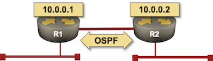

(tutorial-github)=
# Building a Simple 2-Node Lab

In this tutorial, we'll build a simple 2-node network running OSPF.



The easiest way to get started is to [start a GitHub Codespace](https://github.com/codespaces/new/ipspace/netlab-examples). It's free but requires a valid GitHub account.

Alternatively, you could [create a Ubuntu virtual machine](install-ubuntu-vm) on your laptop ([Multipass](https://blog.ipspace.net/2024/03/netlab-bgp-apple-silicon/) seems to be the easiest way to get that done) and [install netlab on it](ubuntu-vm-manual).

Whichever option you choose, I'm assuming you have it up and running and are facing a shell prompt.

## Preparing the Network Device Container Images

We'll use the FRRouting container from a public repository. It will be downloaded during the lab startup process. You can use the same approach for Cumulus VX, Nokia SR Linux, or VyOS.

If you want to use the Arista cEOS container

* Download the image from [Arista's web site](https://www.arista.com/en/support/software-download) (login required). 
* [Copy the image to your GitHub codespace](https://blog.ipspace.net/2024/07/arista-eos-codespaces/) or your virtual machine
* [Install the container image](build-ceos)

## Creating Lab Topology File

In an empty directory, create the [lab topology file](topology-overview) `topology.yml`. 

```
---
provider: clab
defaults.device: frr
module: [ ospf ]

nodes: [ r1, r2 ]
links: [ r1, r2, r1-r2 ]
```

The networking lab specified in the above topology file:

* Uses *containerlab* orchestration system with Docker containers.
* Uses FRRouting containers as the default device
* Uses OSPF as the routing protocol
* Has two nodes (*r1* and *r2*)
* Has three links -- a stub network connected to *r1*, another stub network connected to *r2*, and a link between *r1* and *r2*.

To run the lab with other network devices, replace **defaults.device** value with:

| Device | netlab device code |
|--------|--------------------|
| Arista cEOS | eos |
| Cumulus VX  | cumulus |
| Nokia SR Linux | srlinux |
| VyOS | vyos |

```{tip}
Netlab supports [numerous other network devices](platform-devices), but unfortunately, the vendors don't make them available as pure containers, so running them in GitHub codespaces is impossible.
```

## Starting the Lab

The easiest way to start the lab is to execute **[netlab up](netlab-up)** command which:

* Creates or `clab.yml` (*containerlab* configuration file), and Ansible inventory files;
* Starts the devices with **containerlab deploy** command
* Configures the devices with **netlab initial** command.

### Creating Configuration Files

**netlab up** executes **[netlab create](netlab-create)** to create:

* *containerlab* configuration file
* Device configuration files mapped into FRRouting containers
* `hosts.yml` (Ansible inventory file)
* `host_vars` directory (Ansible host variables)
* `group_vars` directory (Ansible group variables)
* `ansible.cfg` (Ansible configuration file).

Its printout looks similar to this one:

```
┌──────────────────────────────────────────────────────────────────────────────────┐
│ CREATING configuration files                                                     │
└──────────────────────────────────────────────────────────────────────────────────┘
[CREATED] provider configuration file: clab.yml
[MAPPED]  clab_files/r1/daemons to r1:/etc/frr/daemons (from templates/provider/clab/frr/daemons.j2)
[MAPPED]  clab_files/r1/hosts to r1:/etc/hosts (from templates/provider/clab/frr/hosts.j2)
[MAPPED]  clab_files/r2/daemons to r2:/etc/frr/daemons (from templates/provider/clab/frr/daemons.j2)
[MAPPED]  clab_files/r2/hosts to r2:/etc/hosts (from templates/provider/clab/frr/hosts.j2)
[CREATED] transformed topology dump in YAML format in netlab.snapshot.yml
[GROUPS]  group_vars for all
[GROUPS]  group_vars for modules
[GROUPS]  group_vars for frr
[HOSTS]   host_vars for r1
[HOSTS]   host_vars for r2
[CREATED] minimized Ansible inventory hosts.yml
[CREATED] Ansible configuration file: ansible.cfg
```

### Start the Virtual Devices

After creating the configuration files, **netlab up** creates the virtual networking infrastructure (if needed) and starts the lab with **vagrant up** or **sudo containerlab deploy -t clab.yml**.

You can expect to see a printout similar to the one below if you're using VirtualBox:

```
┌──────────────────────────────────────────────────────────────────────────────────┐
│ STARTING clab nodes                                                              │
└──────────────────────────────────────────────────────────────────────────────────┘
provider clab: executing sudo -E containerlab deploy -t clab.yml
INFO[0000] Containerlab v0.54.2 started
INFO[0000] Parsing & checking topology file: clab.yml
INFO[0000] Creating docker network: Name="netlab_mgmt", IPv4Subnet="192.168.121.0/24", IPv6Subnet="", MTU=1500
INFO[0000] Creating lab directory: /home/pipi/net101/tools/X/clab-X
INFO[0000] Creating container: "r2"
INFO[0000] Creating container: "r1"
INFO[0000] Created link: r1:eth1 <--> X_1:r1_eth1
INFO[0000] Created link: r1:eth2 <--> r2:eth2
INFO[0000] Created link: r2:eth1 <--> X_2:r2_eth1
INFO[0000] Adding containerlab host entries to /etc/hosts file
INFO[0000] Adding ssh config for containerlab nodes
+---+-----------+--------------+------------------------------+-------+---------+--------------------+--------------+
| # |   Name    | Container ID |            Image             | Kind  |  State  |    IPv4 Address    | IPv6 Address |
+---+-----------+--------------+------------------------------+-------+---------+--------------------+--------------+
| 1 | clab-X-r1 | b9835b4ef5d2 | quay.io/frrouting/frr:10.0.1 | linux | running | 192.168.121.101/24 | N/A          |
| 2 | clab-X-r2 | 25962c45a991 | quay.io/frrouting/frr:10.0.1 | linux | running | 192.168.121.102/24 | N/A          |
+---+-----------+--------------+------------------------------+-------+---------+--------------------+--------------+
```

### Deploy Device Configurations

To configure the lab devices, **netlab up** runs **[netlab initial](netlab-initial)** command, which runs an Ansible playbook. Its printouts are overly verbose, so we'll skip them.

The **netlab up** process should conclude with a `[SUCCESS] Lab devices configured` message.

```{tip}
If you want to start the lab without configuring the lab devices, use `‌netlab up --no-config`.

If you want to inspect the deployed device configurations, execute `netlab initial -v` -- the Ansible playbook will print out the device configurations before they are deployed -- or `netlab initial -o` to create configuration snippets in the `config` directory.
```

## Connecting to Network Devices

After starting the lab and installing Ansible, you could use the **[netlab connect](netlab-connect)** command to connect to network devices and inspect the OSPF neighbors and IP routing table:

```
$ netlab connect r1
Connecting to container clab-X-r1, starting bash
Use vtysh to connect to FRR daemon

r1(bash)#vtysh

Hello, this is FRRouting (version 10.0.1_git).
Copyright 1996-2005 Kunihiro Ishiguro, et al.

r1# show ip route
Codes: K - kernel route, C - connected, L - local, S - static,
       R - RIP, O - OSPF, I - IS-IS, B - BGP, E - EIGRP, N - NHRP,
       T - Table, v - VNC, V - VNC-Direct, A - Babel, F - PBR,
       f - OpenFabric, t - Table-Direct,
       > - selected route, * - FIB route, q - queued, r - rejected, b - backup
       t - trapped, o - offload failure

O   10.0.0.1/32 [110/0] is directly connected, lo, weight 1, 00:03:29
L * 10.0.0.1/32 is directly connected, lo, 00:03:30
C>* 10.0.0.1/32 is directly connected, lo, 00:03:30
O>* 10.0.0.2/32 [110/10] via 10.1.0.2, eth2, weight 1, 00:03:19
O   10.1.0.0/30 [110/10] is directly connected, eth2, weight 1, 00:03:29
C>* 10.1.0.0/30 is directly connected, eth2, 00:03:30
L>* 10.1.0.1/32 is directly connected, eth2, 00:03:30
O   172.16.0.0/24 [110/10] is directly connected, eth1, weight 1, 00:03:29
C>* 172.16.0.0/24 is directly connected, eth1, 00:03:30
L>* 172.16.0.1/32 is directly connected, eth1, 00:03:30
O>* 172.16.1.0/24 [110/20] via 10.1.0.2, eth2, weight 1, 00:03:19
```

## Cleanup

Destroy the lab with **[netlab down](netlab-down)**. To clean up the working directory, use `netlab down --cleanup`.

```
$ netlab down
Read transformed lab topology from snapshot file netlab.snapshot.yml

┌──────────────────────────────────────────────────────────────────────────────────┐
│ CHECKING virtualization provider installation                                    │
└──────────────────────────────────────────────────────────────────────────────────┘
[SUCCESS] clab installed and working correctly

┌──────────────────────────────────────────────────────────────────────────────────┐
│ STOPPING clab nodes                                                              │
└──────────────────────────────────────────────────────────────────────────────────┘
INFO[0000] Parsing & checking topology file: clab.yml
INFO[0000] Destroying lab: X
INFO[0000] Removed container: clab-X-r1
INFO[0000] Removed container: clab-X-r2
INFO[0000] Removing containerlab host entries from /etc/hosts file
INFO[0000] Removing ssh config for containerlab nodes
```

If you used a GitHub codespace, don't forget to shut it down.