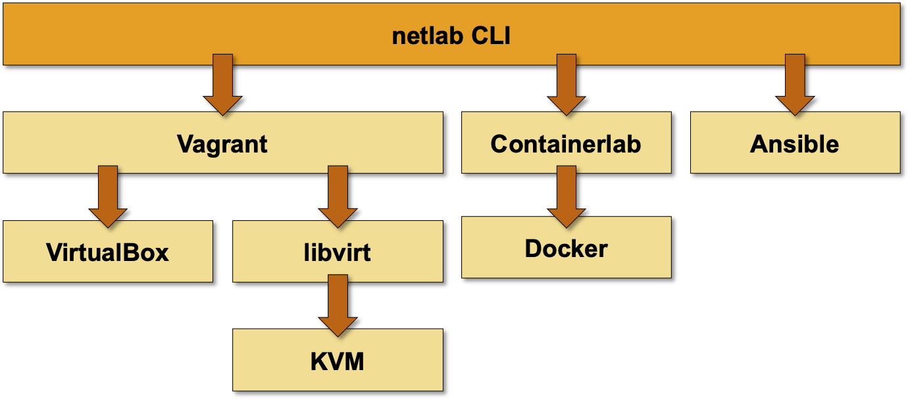

# Installation

*netlab* is a Python3 package[^NSL] that runs on Python 3.8 or later on Windows, MacOS, or Linux. It's a high-level abstraction and orchestration tool that relies on other tools to provide the low-level functionality:

[^NSL]: For legacy reasons, the *netlab* Python code resides in *netsim.\** modules.

* VM/container virtualization: VirtualBox (Windows or MacOS), KVM (Linux) or Docker (Linux)
* Virtualization API: libvirt (used with KVM on Linux)
* VM/container orchestration: Vagrant or containerlab
* Configuration deployment: Ansible 2.9.1[^ANS] or later

[^ANS]: Ansible 2.9 has been tested with Arista EOS, Cisco IOS, IOS-XE and NX-OS, Junos, Cumulus Linux, FRR, generic Linux devices, and VyOS. Other devices might require additional Ansible collections; see [caveats](caveats.md) for further details.



If you already have an environment that can be used with *netlab*, please proceed directly to *[installing Python package](package)*. Otherwise, you'll have to [select the platform](platform) you want to use and [create your lab environment ](lab)(including *netlab* installation).

(platform)=
## Selecting the Platform and Low-Level Tools

We have tested *netlab* with:

* [libvirt/KVM and Vagrant](labs/libvirt.md) on Ubuntu and Fedora. This combination should work on other Linux distributions.
* [Docker and containerlab](labs/clab.md) on Ubuntu. This combination should also work on other Linux distributions.
* [VirtualBox and Vagrant](labs/virtualbox.md) on MacOS with Intel silicon. The same combination should also work on Windows 10. Ansible works on MacOS; RedHat claims it works (but is not supported) within Windows Subsystem for Linux (WSL).

You can also run *netlab* in a [Ubuntu instance in a public cloud](install/cloud.md).

When selecting the virtualization environment, consider the following:

* We are focusing most of our platform development efforts on Linux environments using KVM/libvirt with Vagrant or Docker with containerlab. We have selected Ubuntu as the Linux distribution supported by **netlab install** command. The installation guide for Ubuntu is thus the most extensive one.

* **Vagrant provider for libvirt** supports parallel VM provisioning, resulting in much faster lab creation. An added bonus: if you decide to use Ubuntu, you can use **[netlab install](netlab/install.md)** command to install all the prerequisite software (KVM, libvirt, Vagrant, Docker, containerlab, Ansible).

  Unfortunately, most vendors don't offer virtual devices packaged as libvirt Vagrant boxes, so you'll have to build your own boxes.

* **Containers** provisioned with containerlab start much faster than virtual machines, but you can get only a few network devices in native container format (Arista cEOS, Nokia SR Linux, Cumulus VX, FRR).

* **VirtualBox** is commonly used together with Vagrant as a laptop virtualization solution, resulting in a wider variety of prepackaged boxes (Arista vEOS, Cisco Nexus 9300v, Cumulus VX, Juniper vSRX). The downsides: 

  * Slow lab setup due to serial provisioning;
  * No management network (Vagrant uses a weird port NAT to access virtual machines)
  * _netlab_ cannot integrate VirtualBox networking with the external world

(lab)=
## Creating the Lab Environment

We have documented how you can set up your lab:

* On a [Ubuntu virtual machine running on Windows or MacOS](install/ubuntu-vm.md).
* On a [generic Ubuntu VM or bare-metal Ubuntu server](install/ubuntu.md)
* On [other Linux distributions](install/linux.md)
* In a [public cloud](install/cloud.md)

```{tip}
* If you decide to run the network labs within an Ubuntu VM, [create a new VM and use the automated software installation procedure](install/ubuntu-vm.md). It's much easier and safer than trying to install the necessary software on an existing VM.
* Don't use VirtualBox on Linux. As you won't need a GUI to interact with the network devices, we see no reason to do that when there are better alternatives (KVM+libvirt).
```

If you insist on running network devices directly on your Windows or MacOS (Intel silicon) laptop, try out [VirtualBox with Vagrant](labs/virtualbox.md). This setup won't be able to run network devices packaged as containers (Arista cEOS, Nokia SR Linux).

Finally, while _netlab_ runs on Apple silicon, you won't be able to start virtual machines or containers as they're not available for ARM CPUs. If you own a laptop with Apple silicon, run your labs on an external x86 server ([Ubuntu VM](ubuntu-vm-manual) running on-premises or in a [public cloud](install/cloud.md), or a [bare-metal server](install/ubuntu.md))

## Building Vagrant Boxes

* You might have to build Vagrant boxes for your network devices if you decide to use [*libvirt* with KVM on a Linux system](labs/libvirt.md). *netlab* includes [box building recipes](libvirt-vagrant-boxes) for most supported platforms.
* You can get a [few network devices as Docker containers](labs/clab.md#container-images) you can use with [*containerlab*](labs/clab.md).
* Some vendors offer [Vagrant boxes for the VirtualBox environment](labs/virtualbox.md). We don't maintain VirtualBox-specific build recipes for other network operating systems.

(package)=
## Installing Python Package

To install *netlab* on a system that already has the low-level tools installed, use `python3 -m pip install networklab`. The installation process will install all prerequisite Python packages and create the **netlab** command.

If you want to get the latest development code or if you want to participate in *netlab* development, [clone the GitHub repository](install/clone.md).

```eval_rst
.. toctree::
   :caption: Next Steps
   :maxdepth: 1
   :hidden:

   labs/virtualbox.md
   install/ubuntu-vm.md
   install/ubuntu.md
   install/linux.md
   install/cloud.md
   labs/libvirt.md
   labs/clab.md
   install/clone.md
```
