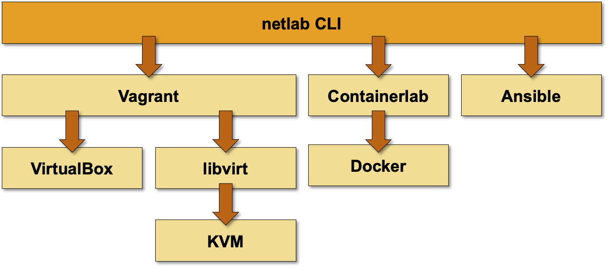

# Installation

*netlab* is a Python3 package[^NSL] that uses Python 3.10[^P310] or later. It runs on Linux[^NLE] (we're doing all our tests on Ubuntu), including Windows Subsystem for Linux or [Multipass on macOS](https://blog.ipspace.net/2024/03/netlab-bgp-apple-silicon/).

[^P310]: Python 3.10 is the minimum supported version because it's the default Python distribution on Ubuntu 22.04.

[^NSL]: For legacy reasons, the *netlab* Python code resides in *netsim.\** modules.

[^NLE]: Although it might be possible to run _netlab_ on other operating systems, please don't complain if it doesn't work.

_netlab_ is a high-level abstraction and orchestration tool that relies on other tools to provide the low-level functionality:

* Container/VM virtualization with Docker, Podman, or libvirt/KVM
* Container/VM orchestration with containerlab or Vagrant
* Configuration deployment with shell scripts, netmiko, or Ansible[^ANS]

[^ANS]: Our [integration tests](https://release.netlab.tools/) use recent Ansible versions. Some devices might require additional Ansible collections; see [caveats](platform-caveats) for further details.



If you already have a Linux environment you can use with *netlab*, please proceed directly to [Ubuntu server installation](install-ubuntu) or [generic Linux installation](install-linux-server).

Otherwise, you'll have to [select the platform](platform) you want to use and [create your lab environment ](lab)(including *netlab* installation). If you don't want to invest your time in building a Linux VM, run _netlab_ with container-based network devices in GitHub Codespaces ([netlab examples](https://blog.ipspace.net/2024/07/netlab-examples-codespaces/), [BGP labs](https://bgplabs.net/4-codespaces/), [IS-IS labs](https://isis.bgplabs.net/4-codespaces/), [EVPN labs](https://evpn.bgplabs.net/4-codespaces/), [SR-MPLS labs](https://github.com/ipspace/sr-workshop)).

(platform)=
## Selecting the Platform and Low-Level Tools

We test *netlab* with [Docker/containerlab](lab-clab) and [libvirt/Vagrant](lab-libvirt) on Ubuntu. Both combinations should work on non-Debian-based Linux distributions but will likely require manual software installation.

You can also run *netlab* in a [Linux virtual machine](install-ubuntu-vm) or a [Ubuntu instance in a public cloud](install-cloud).

When selecting the virtualization environment, consider the following:

* Ubuntu-based _netlab_ is the easiest to set up; the **[netlab install](netlab-install)** command does all the heavy lifting for you and installs all the prerequisite software (KVM, libvirt, Vagrant, Docker, containerlab, Ansible).
* **Containers** provisioned with containerlab start much faster than virtual machines, but you can get only a few network devices in native container format (Arista cEOS, Cisco IOS XRd, FRR, Juniper cRPD, Nokia SR Linux and SR-SIM, VyOS). The [**vrnetlab** fork by Roman Dodin](https://github.com/srl-labs/vrnetlab) can build containers that run virtual machines for many network devices, but those containers might take longer to start than Vagrant boxes.
* **Vagrant provider for libvirt**[^VBR] supports parallel VM provisioning, resulting in pretty fast lab creation. Unfortunately, you'll have to build the libvirt Vagrant boxes manually, but the **[netlab libvirt package](netlab-libvirt-package)** usually does 90% of the work for you. However, we're [no longer developing new Vagrant functionality](libvirt-sunset), so you might be better off focusing on [containerlab](lab-clab).

[^VBR]: **VirtualBox** support (available in earlier _netlab_ releases) has been removed. It is no longer needed on Windows; Windows Subsystem for Linux is a much better option. Apple stopped shipping x86-based hardware years ago, and no major vendor is shipping ARM-based VM images for network devices.

(lab)=
## Creating the Lab Environment

We have documented how you can set up your lab:

* On a [Ubuntu virtual machine running on Windows or macOS](install-ubuntu-vm).
* On a [generic Ubuntu VM or bare-metal Ubuntu server](install-ubuntu)
* In a [public cloud](install-cloud)
* On [other Linux distributions](install-linux-server)[^OLD]
* From the [GitHub repository](install-clone)[^GHR]

[^OLD]: Use this procedure when you don't want to use netlab installation scripts

[^GHR]: Useful when you want to run the latest code or participate in netlab development

```{tip}
If you decide to run the network labs within an Ubuntu VM, [create a new VM and use the automated software installation procedure](install-ubuntu-vm). Starting with a fresh VM is much easier and safer than installing the necessary software on an existing VM.
```

Finally, you can use _netlab_ on Apple Silicon ([basics](https://blog.ipspace.net/2024/03/netlab-bgp-apple-silicon/), [using Arista cEOS](https://blog.ipspace.net/2025/02/arista-ceos-arm-apple-silicon/)), but all we managed to do was run containers (Arista EOS, FRR, SR Linux) on a Multipass-provisioned Ubuntu VM. If you're using a laptop with Apple silicon, run more complex labs on a [Ubuntu VM](ubuntu-vm-manual) running on-premises or in a [public cloud](install-cloud), or a [bare-metal server](install-ubuntu).

```eval_rst
.. toctree::
   :caption: Next Steps
   :maxdepth: 1
   :hidden:

   install/ubuntu-vm.md
   install/ubuntu.md
   install/linux.md
   install/cloud.md
   install/clone.md
```

## Next Steps

* [](lab-clab)
* [](lab-libvirt)
