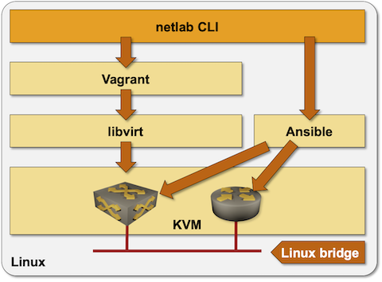

# Running *netlab* on a Linux Server

This page describes generic installation steps you have to follow to create a virtual lab environment on any Linux server. If you plan to run your labs on a Ubuntu server, [follow these instructions](ubuntu.md).

## Prerequisite Software Installation

*netlab* is a Python package that uses KVM to run virtual machines and Docker to run containers. Virtual machines in KVM environment and the associated Linux bridges are created with Vagrant using libvirt API. Ansible is used to configure the network devices.



To build a Linux environment needed to run network devices as virtual machines or containers:

* Install Python 3.8 or later
* Install KVM and libvirt
* Install Vagrant 2.2.14 or later
* Install *vagrant-libvirt* plugin with `vagrant plugin install libvirt --plugin-version=0.11.2`
* Install Ansible 2.9.1 or later and any Ansible networking dependencies (example: paramiko)
* Optional: install Docker and containerlab

## netlab Installation

Install Python package with `sudo python3 -m pip install networklab` or your preferred Python package installation procedure.

## Creating *vagrant-libvirt* Virtual Network

*vagrant-libvirt* plugin connects management interfaces of managed VMs to *vagrant-libvirt* virtual network. Vagrant can figure out the device IP address based on dynamic DHCP mappings; *netlab* can't. To make the Ansible inventory created by **[netlab create](../netlab/create.md)** work, your virtual network MUST include static DHCP bindings that map management MAC addresses defined in *netlab* data model into expected IP addresses.

**[netlab up](../netlab/up.md)** command automatically creates *vagrant-libvirt* virtual network with correct static DHCP bindings before calling **vagrant up**, so you SHOULD use **netlab up** instead of executing **vagrant** commands. Recent versions of *vagrant-libvirt* plugin remove the *vagrant-libvirt* virtual network on **vagrant destroy**, so it makes no sense to create that network manually.

## Testing the Installation

The easiest way to test your installation is to use **[netlab test](../netlab/test.md)** command. If you prefer to do step-by-step tests, you might find this recipe useful:

* Create an empty directory and `topology.yml` file with the following contents within that directory:

```
---
defaults:
  device: cumulus

module: [ ospf ]

nodes: [ s1, s2, s3 ]
links: [ s1-s2, s2-s3, s1-s2-s3 ]
```

* Start the lab with `netlab up`
* Connect to the Cumulus VX devices with `vagrant ssh` or `netlab connect`
* Destroy the lab with `netlab down`

```eval_rst
.. toctree::
   :caption: Next Steps
   :maxdepth: 1
   :titlesonly:

   ../labs/libvirt.md
   ../labs/clab.md
```
