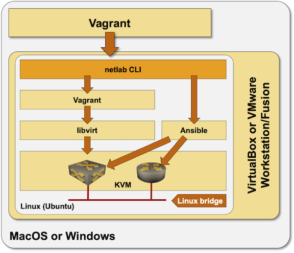

# Ubuntu VM Installation

If you have a Windows- or MacOS-based computer and would like to use *netlab* with *libvirt*[^1] or run network devices as containers, you'll have to run the whole toolchain needed to create networking labs (netlab ⇨ Vagrant ⇨ libvirt ⇨ KVM) within a Linux virtual machine. The easiest way to do that is to create a Ubuntu virtual machine and use **netlab install** command within that virtual machine to install the required software packages[^2].



[^1]: The *libvirt* Vagrant plugin starts all network devices in parallel, resulting in much faster lab setup than using Vagrant with Virtualbox.

[^2]: See also the [tutorial created by Leo Kirchner](https://blog.kirchne.red/netsim-tools-quickstart.html).

```{warning}
Running *‌libvirt* within a Ubuntu VM requires *‌nested virtualization*. Nested virtualization was available in VMware Workstation/Fusion for years and was recently added to VirtualBox. While VMware products perform flawlessly, you might get unacceptable performance with VirtualBox nested virtualization on some Intel CPUs (example: MacBook Pro 2020, Intel Core i5 CPU).
```

The easiest way to set up a Ubuntu VM is to [use Vagrant](vagrant). Vagrant will automatically:

* Download the required virtual disk image
* Start the virtual machine
* Enable SSH access to the virtual machine
* Provision the software on the virtual machine

You can also [create the virtual machine yourself](manual) (using, for example, VirtualBox or VMware GUI)

(vagrant)=
## Creating Ubuntu VM with Vagrant

Installation steps:

* Install [VirtualBox](https://www.virtualbox.org/wiki/Downloads) or VMware Fusion/Workstation
* Install [Vagrant](https://www.vagrantup.com/docs/installation)
* Install [Vagrant VMware provider](https://www.vagrantup.com/docs/providers/vmware) if you're using VMware Workstation/Fusion.
* Create an empty directory. Create **Vagrantfile** with the following content in that directory. Change the **memory**/**memsize** or **cpus**/**numvcpus** settings to fit your hardware.
* Change the Vagrant box from `generic/ubuntu2004` to `bento/ubuntu-20.04` if the generic Ubuntu box is not available for your Vagrant provider.

```
Vagrant.configure("2") do |config|
  config.vm.box = "generic/ubuntu2004"
#  config.vm.box = "bento/ubuntu-20.04"

  config.vm.provider "virtualbox" do |vb|
    vb.memory = "8192"
    vb.cpus = 4
    vb.customize ['modifyvm', :id, '--nested-hw-virt', 'on']
  end

  config.vm.provider "vmware_fusion" do |v|
    v.vmx["memsize"] = 8192
    v.vmx["numvcpus"] = "4"
    v.vmx["vhv.enable"] = "TRUE"
  end

  config.vm.provider "vmware_desktop" do |v|
    v.vmx["memsize"] = 8192
    v.vmx["numvcpus"] = "4"
    v.vmx["vhv.enable"] = "TRUE"
  end

  config.vm.provision "shell", privileged: false, inline: <<-SHELL
    sudo apt-get update
    sudo apt-get install -y python3-pip
    sudo pip3 install --ignore-installed networklab
    sudo pip3 install --upgrade pyopenssl cryptography
    netlab install -y ubuntu ansible libvirt containerlab
  SHELL
end
```

* Execute **vagrant up** and wait for the installation to complete. If you're using VMware Workstation or Fusion you MUST specify the **--provider** argument in **vagrant up** command when you're creating the VM (but not on subsequent starts).
* Log into the virtual machine with **vagrant ssh** and test the installation with **netlab test**

(manual)=
## Manual Virtual Machine Provisioning

* Create a Ubuntu 20.04 virtual machine within your virtualization environment (you'll find plenty of tutorials on the Internet)
* Log into the virtual machine
* Execute these commands to download Python3 and install *netlab*, Ansible, vagrant, libvirt, KVM, containerlab, and Docker.

```
sudo apt-get update
sudo apt-get install -y python3-pip
sudo pip3 install --ignore-installed networklab
sudo pip3 install --upgrade pyopenssl cryptography
netlab install -y ubuntu ansible libvirt containerlab
```

* After completing the software installation, you might have to use **usermod** to add your user to *libvirt* and *docker* groups.

```eval_rst
.. toctree::
   :caption: Next Steps
   :maxdepth: 1
   :titlesonly:

   ../labs/libvirt.md
   ../labs/clab.md
```
