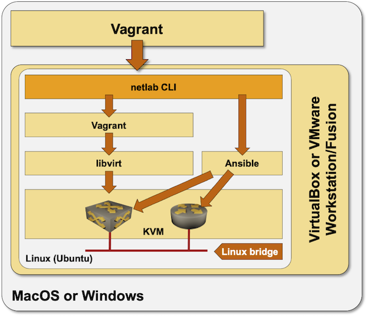

(install-ubuntu-vm)=
# Ubuntu VM Installation

The easiest way to set up your lab environment on your laptop or in your virtualized compute infrastructure is to create an Ubuntu virtual machine (use the WSL virtual machine on Windows) and run the **netlab install** command inside it to install the required software packages. You could also run _netlab_ on a [Ubuntu instance in a public cloud](install-cloud).

```{warning}
Running *‌libvirt* within an Ubuntu VM requires *‌nested virtualization*. You don't need nested virtualization to run Docker containers within an Ubuntu VM.
```

The easiest way to run an Ubuntu VM on Windows is to use [Windows Subsystem for Linux](ubuntu-vm-wsl).

On other platforms, [Canonical Multipass](https://multipass.run/) is probably the easiest way to start an Ubuntu VM on your laptop if you don't need nested virtualization. Create an instance with [as much RAM and as many CPU cores](https://multipass.run/docs/create-an-instance#heading--create-an-instance-with-custom-cpu-number-disk-and-ram) as you can afford, and [install the necessary software on it](ubuntu-vm-manual).

You can also use [Vagrant](ubuntu-vm-vagrant) or [create the virtual machine yourself](ubuntu-vm-manual) (for example, using the VMware GUI).

(ubuntu-vm-wsl)=
## Running netlab on Windows Subsystem for Linux

* Follow Microsoft's documentation to install Windows Subsystem for Linux.
* Ensure you have WSL version 2.7.10.0 (or later) and use the latest Ubuntu or Debian image.
* Add the following lines to the `/etc/wsl.conf` file:

```
[boot]
systemd=true
```

* Follow the [_netlab_ on Ubuntu VM](ubuntu-vm-manual) installation instructions

(ubuntu-vm-vagrant)=
## Creating Ubuntu VM with Vagrant

You can use Vagrant to set up an Ubuntu VM on your computer. Vagrant will automatically:

* Download the required virtual disk image
* Start the virtual machine
* Enable SSH access to the virtual machine
* Provision the software on the virtual machine



Installation steps (assuming you're using VMware Fusion):

* Install VMware Fusion/Workstation
* Install [Vagrant](https://www.vagrantup.com/docs/installation)
* Install [Vagrant VMware provider](https://www.vagrantup.com/docs/providers/vmware) if you're using VMware Workstation/Fusion.
* Create an empty directory. In that directory, create a **Vagrantfile** with the following content[^BB]. Change the **memory**/**memsize** or **cpus**/**numvcpus** settings to fit your hardware.

[^BB]: We have to use a box built by the Bento project because [Ubuntu no longer provides Vagrant boxes](https://documentation.ubuntu.com/public-images/public-images-explanation/vagrant/).

```
Vagrant.configure("2") do |config|
  config.vm.box = "bento/ubuntu-24.04"

  config.vm.provider "vmware_fusion" do |v|
    v.vmx["memsize"] = 8192
    v.vmx["numvcpus"] = "4"
    v.vmx["vhv.enable"] = "TRUE"
  end

  config.vm.provider "vmware_desktop" do |v|
    v.vmx["memsize"] = 8192
    v.vmx["numvcpus"] = "4"
    v.vmx["vhv.enable"] = "TRUE"
  end

  config.vm.provider "libvirt" do |lv|
    lv.memory = "8192"
    lv.cpus = 4
    lv.nested = true
  end

  config.vm.provision "shell", privileged: false, inline: <<-SHELL
    sudo apt-get update
    sudo apt-get install -y python3-pip
    sudo pip3 install --ignore-installed --break-system-packages networklab
    netlab install -y ubuntu ansible libvirt containerlab
  SHELL
end
```

```{tip}
The above Vagrantfile installs Python packages as root. That differs from the recommended best practice and is used primarily because we're setting up a single-purpose VM.

Remove the **‌pip3** and **‌netlab** commands from the Vagrantfile and [follow these steps](install-ubuntu-venv) if you want to install _netlab_ in a Python virtual environment
```

* Execute **vagrant up** and wait for the installation to complete. If you're using VMware Workstation or Fusion, specify the **--provider** argument in the **vagrant up** command when creating the VM (but not on subsequent starts).
* Log into the virtual machine with **vagrant ssh** and test the installation with **[netlab test](netlab-test)**

(ubuntu-vm-manual)=
## Manual Virtual Machine Provisioning

* Create an Ubuntu 22.04 or Ubuntu 24.04 virtual machine within your virtualization environment (you'll find plenty of online tutorials). If needed, enable nested virtualization.
* Log into the virtual machine
* Execute these commands to download Python3 and install *netlab*, Ansible, vagrant, libvirt, KVM, containerlab, and Docker, or [follow these steps](install-ubuntu-venv) if you want to install _netlab_ in a Python virtual environment

```
sudo apt-get update
sudo apt-get install -y python3-pip
sudo pip3 install --ignore-installed networklab
netlab install -y ubuntu ansible libvirt containerlab
```

```{tip}
* Installing Python packages as root is not the recommended best practice. We're using this approach because we're setting up a single-purpose VM.
* Ubuntu 24.04 and later want you to install Python packages in a virtual environment. To stop the complaints, add the `--break-system-packages` option to the **pip3 install** command.
* Running multiple installation scripts with **‌netlab install** might fail on some Ubuntu distributions. If you experience that problem, execute multiple **‌netlab install** commands (one per installation script).
```

* After completing the software installation, log out, log back in (to get new group memberships), and test your installation with the **[netlab test](netlab-test)** command. If those tests fail, you might have to use **sudo usermod** to add your user to the *libvirt* and *docker* groups.

## Next Steps

* [](lab-clab)
* [](lab-libvirt)
