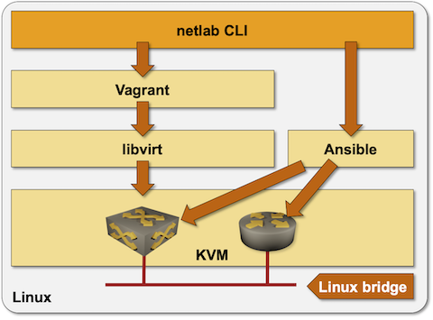

(install-ubuntu)=
# Ubuntu Server Installation

On a Linux system, *netlab* uses Docker or Podman to run containers[^CVM] and libvirt/KVM to run virtual machines. Virtual machines in the KVM environment and the associated Linux bridges are created with Vagrant using the libvirt API. Shell scripts, Netmiko, or Ansible configure the network devices.

[^CVM]: Or virtual machines running in containers [created with *vrnetlab* tool](clab-vrnetlab).



The simplest way to install *netlab* and the whole low-level toolchain on an existing Ubuntu server (bare-metal or VM) is to use the **[netlab install](../netlab/install.md)** command (see below). You could also [do manual software installation](linux.md).

* If needed, install Python3 and **pip3** with `sudo apt-get update && sudo apt-get install -y python3-pip`
* Install the _netlab_ Python package with `sudo python3 -m pip install networklab` or your preferred Python package installation procedure.

```{tip}
* If you're not setting up a throwaway VM/server, please use your regular Python installation procedure to install the `networklab` package.
* Ubuntu 22.04 and later want you to install Python packages in a virtual environment. If you're working on a throwaway VM/server, stop **‌pip** complaints with the `--break-system-packages` option.
* [Read this section](install-ubuntu-venv) if you want to install _netlab_ in a Python virtual environment
```

* Install additional software with `netlab install ubuntu ansible libvirt containerlab` command ([more details](netlab-install)).

```{tip}
Running multiple installation scripts with **‌netlab install** might fail on some Ubuntu distributions. If you experience that problem, execute multiple **‌netlab install** commands (one per installation script).
```

* After completing the software installation, log out, log back in (to get new group memberships), and test your installation with the **[netlab test](netlab-test)** command ([other options](install-linux-server-test)). If those tests fail, you might have to use **sudo usermod** to add your user to the *libvirt* and *docker* groups.

(install-ubuntu-venv)=
## Installing netlab into a Python Virtual Environment

Follow this procedure[^TB24] if you don't want to install system-wide Python packages on your Ubuntu system:

[^TB24]: Tested on Ubuntu 24.04 running as `bento/24-04` Vagrant box

* Make sure your user is part of the **sudo** group, and that **sudo** works without a password (that's the setup you usually get after installing Ubuntu).
* Update APT repositories and install **pip3** and Python virtual environment package:

```
$ sudo apt-get update
$ sudo apt-get install -y python3-pip python3-venv
```

* Create a Python virtual environment, preferably in your home directory (make sure you use the `--system-site-packages` parameter).

```
$ cd ~
$ python3 -m venv --system-site-packages mylab
```

* Activate the virtual environment

```
$ source mylab/bin/activate
```

* Install **netlab** and use **netlab install** to install other software components:

```
$ pip3 install networklab
$ netlab install ubuntu containerlab libvirt ansible
```

```{tip}
* Running multiple installation scripts with **‌netlab install** might fail on some Ubuntu distributions. If you experience that problem, execute multiple **‌netlab install** commands (one per installation script).
* Use ideas from [this discussion](https://github.com/ipspace/netlab/discussions/2704) if **ansible** installation fails with **‌pip3** errors.
```

* Log out and log back in. Activate the virtual environment (you have to do that every time you log in unless you add the **source** command to your shell login script):

```
$ source mylab/bin/activate
```

* Use the **groups** command to check that your user belongs **vagrant** and **libvirt** groups when using *libvirt*, or **docker** and **clab_admins** groups when using *containerlab*.
* Test your installation with **netlab test libvirt** or **netlab test clab**.

## Next Steps

* [](lab-clab)
* [](lab-libvirt)
