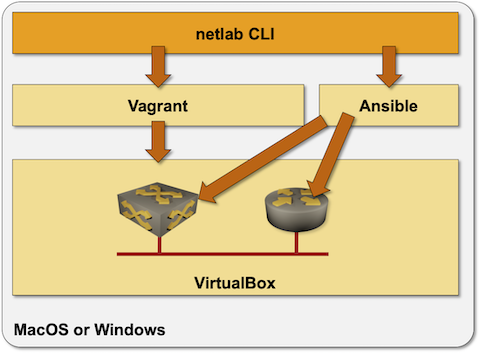

# Virtualbox-Based Lab on Windows or MacOS

Virtualbox-based Vagrant lab is the only option if you want to run *netsim-tools* directly on Windows or MacOS (you could also run them [within a Ubuntu VM](../install/ubuntu-vm.md)):

* [netlab](../netlab/cli.md) commands will create Ansible inventory and Vagrant configuration
* Vagrant will create virtual networks within VirtualBox environment and start network devices as virtual machines within VirtualBox
* Ansible will connect to the network devices and configure them



The environment is pretty easy to set up:

* [Install Virtualbox](https://www.virtualbox.org/wiki/Downloads) (might require fiddling with BIOS setup on Ubuntu bare-metal installations)
* [Install Vagrant](https://www.vagrantup.com/docs/installation)
* Install *netsim-tools* with `pip3 install netsim-tools`
* [Install Ansible](https://docs.ansible.com/ansible/latest/installation_guide/intro_installation.html)[^1] and device-specific requirements.
* Test the installation with **[netlab test virtualbox](../netlab/test.md)** command

## Creating a New Lab
To create a new lab:

* Create [lab topology file](../topology-overview.md) in an empty directory. Use `provider: virtualbox` in lab topology to select the *virtualbox* virtualization provider.
* Execute **[netlab up](../netlab/up.md)**

Alternatively, you could use **[netlab create](../netlab/create.md)** script to create *Vagrantfile* and Ansible inventory, and **vagrant up** to start the lab.

[^1]: Running Ansible on Windows is not supported, but supposedly it runs just fine under WSL. 

## Testing the Installation

The easiest way to test your installation is to use **netlab test** command. If you prefer to do step-by-step tests, or if you don't want to use WSL on Windows, you might find this recipe useful:

* Create an empty directory and `topology.yml` file with the following contents within that directory:

```
---
defaults:
  device: cumulus

nodes: [ s1, s2, s3 ]
links: [ s1-s2, s2-s3, s1-s2-s3 ]
```

* Create Vagrantfile with `netlab create`
* Execute `vagrant up` to spin up three Cumulus VX virtual machines
* Connect to the Cumulus VX devices with `vagrant ssh`
* Destroy the lab with `vagrant destroy -f`

## Creating Vagrant Boxes

Vagrant relies on *boxes* (prepackaged VM images). The following Vagrant boxes are automatically downloaded from Vagrant Cloud when you're using them for the first time in your lab topology:

| Virtual network device | Vagrant box name   |
|------------------------|--------------------|
| Cumulus VX             | CumulusCommunity/cumulus-vx:4.4.0 |
| Cumulus VX 5.0 (NVUE)            | CumulusCommunity/cumulus-vx:5.0.1|
| Generic Linux          | generic/ubuntu2004 |

You'll have to download Arista vEOS and Nexus 9300v images from the vendor web site (requires registration) and install them with **vagrant box add _filename_ \-\-name _boxname_** command. You'll find build recipes for other network devices on [codingpackets.com](https://codingpackets.com/blog/tag/vagrant/).

You have to use the following box names when installing or building the Vagrant boxes:

| Virtual network device | Vagrant box name   |
|------------------------|--------------------|
| Arista vEOS            | arista/veos        |
| Cisco IOSv             | cisco/iosv         |
| Cisco CSR 1000v        | cisco/csr1000v     |
| Cisco Nexus 9300v      | cisco/nexus9300v   |
| Juniper vSRX 3.0       | juniper/vsrx3      |

**Notes**:

* Arista rarely ships the latest software version as a Vagrant box. You'll usually have to build your own box if you want to have an up-to-date EOS version.
* Vagrantfile created by **netlab create** or **netlab up** sets up port forwarding for SSH (22), HTTP (80) and NETCONF (830), but the corresponding Ansible inventory contains only **ansible_port** (SSH). You could edit the final inventory by hand, add extra file to `host_vars`, or fix *netsim-tools* code. Should you decide to do the latter, please contact us in advance to discuss the necessary data structures.
* If you want to add other network devices, build your own Vagrant boxes and modify system *topology-defaults.yml* file or [user defaults](defaults-user-file) (see [_adding new virtualization provider for an existing device_](../dev/device-platform.md) for more details). 
