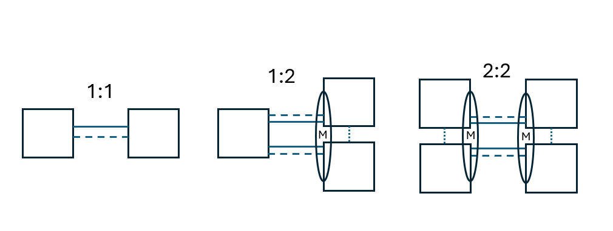

(module-lag)=
# Link Aggregation Group (LAG) Configuration Module for IEEE 802.3ad

This configuration module configures a link aggregation group (LAG) between a pair of devices, including Multi-Chassis (MLAG)

(lag-platform)=
LAG is currently supported on these platforms:

| Operating system      | LACP | Static | Passive<br>LACP | MLAG
| --------------------- |:--:|:--:|:--:|:---:|
| Arista EOS [❗](caveats-eos) | ✅ | ✅ | ✅ | ✅ |
| Aruba AOS-CX [❗](caveats-aruba) | ✅ | ✅ | ✅ | ✅ |
| Cisco IOL L2[^iol2] | ✅ | ✅ | ✅ | ❌ |
| Cisco IOSV L2[^iol2]  | ✅ | ✅ | ✅ | ❌ |
| Cumulus Linux 4.x     | ✅ | ✅ | ❌  | ❌ |
| Cumulus 5.x (NVUE)    | ✅ | ✅ | ❌  | ✅ |
| Dell OS10             | ✅ | ✅ | ✅  | ✅ |
| FRR                   | ✅ | ✅ | ❌  | ❌ |
| Generic Linux hosts   | ✅ | ✅ | ❌  | ❌ |
| JunOS[^Junos]         | ✅ | ✅ | ✅  | ❌ |

[^Junos]: Includes vSRX, vPTX and vJunos-switch. vJunos-router (and vMX) do not support LAG.
[^iol2]: Port-Channel interfaces will be treated like physical interfaces. Setting LACP rate is not avilable.

## Parameters

The following parameters can be set globally, per node or link aggregation group:

* **lag.lacp**: LACP protocol interval: **fast** (1-second LACP timer, default value), **slow** (30-second LACP timer) or **off** (LACP is disabled).
* **lag.lacp_mode**: **active** (default) or **passive** (only one of the nodes can be passive)

```{tip}
* The  _link down_ condition is not easily detectable in a virtual environment. Do not turn off LACP.
* The **lag.mode** parameter from the original implementation of this module is no longer used. Use the Host-Side Link Bonding plugin to configure non-LAG device bonding on Linux.
```

The following parameters can be set on individual links:

* **lag.members**: Mandatory list of links that form the LAG. It uses the [same format as the topology **links** list](link-formats).
* **lag.ifindex**: Optional parameter that controls the naming of the LAG (bonding, port-channel) interface.
* **lag.mlag**: Optional dictionary with peer link parameters; see [below](lag-mlag)

This configuration module creates a virtual link with the link type set to **lag** between the **lag.members** and appends the links described in the **lag.members** list to the topology **links** list.

## Example

The following example creates a LAG consisting of 2 links between r1 and r2:

```
module: [ lag ]

nodes: [ r1, r2 ]

links:
- lag.members: [ r1-r2, r1-r2 ]
```

You can specify any link parameter on the *lag* link.

If you require additional physical interface attributes on individual member links (or interfaces), use the dictionary link format in the **lag.members** list. The following example sets **ifindex** on every LAG member Ethernet interface to [change the Ethernet interface name](links-ifname).

```
links:
- lag.members:
  - r1:
     ifindex: 49  # Use 100G links 1/1/49 and 1/1/50
    r2:
     ifindex: 49
  - r1:
     ifindex: 50
    r2:
     ifindex: 50
```

(lag-multi-provider)=
### Caveat: Multi-provider Labs

_netlab_ implements links between containers and virtual machines with Linux bridges that block LACP packets. Package virtual machines into [vrnetlab](clab-vrnetlab) containers to connect them to pure containers.

(lag-mlag)=
## Multi-chassis Link Aggregation (MLAG)

For platforms that support it, link-level redundancy can be provided by creating multiple links to different switches. The switches have an internal *peer link* to synchronize the state related to the link aggregation, allowing them to present a consistent network interface to the connected system.


The above diagram illustrates the three supported topologies:
* 1:1 LAG between 2 nodes
* 1:2 MLAG between 1 node and a pair of 2 nodes interconnected through one or more peer links (3 nodes in total)
* 2:2 dual MLAG between 2 pairs of nodes (4 nodes in total)

MLAG related parameters:

Node/interface level:
* **lag.mlag.mac**: Used at node or interface level to configure the MAC address for the peer link. *Netlab* can auto-generate this, so it is usually not necessary to set this

Link level:
* **lag.mlag.peergroup**: This parameter configures a unique peer group ID for the pair of MLAG switches. Can be set to *True* for auto-id generation or an integer (that must be globally unique)

A simple example:
```
groups:
  _auto_create: True
  core:
    members: [s1,s2]
    device: dellos10
  edge:
    members: [h1,h2]
    device: frr

links:
- lag:
    members: [h1-s1,h1-s2]
- lag:
    members: [h2-s1,h2-s2]

# Inter-switch peer link(s) for MLAG sync
- lag:
    members: [s1-s2]     # Note that multiple physical links are allowed here
    mlag.peergroup: True # (also) used to derive a unique MAC address for this group of MLAG peers
```

### Advanced MLAG Parameters

The **lag.mlag.peer.backup_ip** _device feature_ specifies a property from the node data model that should be used to determine the MLAG peer's backup IP address (the IP address an MLAG node tries to reach when resolving a split-brain scenario). This parameter is part of the device features and can be changed only for a device type, not individual nodes.

The default value is `loopback.ipv4` (the loopback interface's IPv4 address), which may require an IGP between the MLAG peers. Another interesting value of this parameter is `mgmt.ipv4` (the management IPv4 address). Other values such as *interfaces[3].ipv4* could theoretically be used, though note that such addresses are assumed to reside in the default VRF - no attempt is made to determine or verify which VRF they are in.

For example, to use the management IPv4 address as the MLAG backup IP on Cumulus Linux using NVUE (device `cumulus_nvue`), set the following value in your [lab topology](defaults-topology), [user defaults](defaults-user-file), or [system defaults](defaults-locations):

```
defaults.devices.cumulus_nvue.features.lag.mlag.peer.backup_ip: mgmt.ipv4
```
