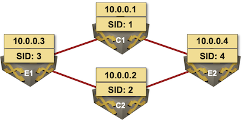

# Segment Routing (MPLS) Configuration Module

This configuration module configures SR-MPLS within IS-IS routing process on Cisco IOS XE (CSR) and Arista EOS.

Supported Segment Routing features:

* IPv4 and IPv6 (see Notes)
* IS-IS routing protocol
* IPv4 Node SID: set to node ID
* IPv6 Node SID: set to node ID + 100

The module depends on IS-IS module and will trigger a configuration error if the **isis** module is not enabled in the network topology.

**Notes:**
* Cisco IOS XE (that I used in my lab) does not support IPv6 Node SID with IS-IS. The Cisco IOS configuration templates are thus IPv4-only.

### Parameters

The SR-MPLS module has no configurable parameters.

## Example

We want to create a four-router multi-vendor SR-MPLS network.



All devices run IS-IS and SR-MPLS:
```
module: [ sr,isis ]
```

We want to use unnumbered P2P interfaces and dual-stack deployment with IPv6 configured on loopback addresses:

```
addressing:
  p2p:
    unnumbered: true
  loopback:
    ipv6: 2001:db8:cafe::/48
```

Two of the devices in our topology run Cisco IOS XE, the other two run Arista EOS:

```
nodes:
  e1:
    device: csr
  e2:
    device: eos
  c1:
    device: csr
  c2:
    device: eos
```

The devices are connected into a square topology with two of them having stub links:

```
links:
- e1-c1
- e1-c2
- e2-c1
- e2-c2
- e1
- e2
```

### Resulting Device Configurations

The above topology generates the following device configurations (focusing just on segment routing and IS-IS parts).

#### E1 (Cisco IOS)

```
segment-routing mpls
 !
 set-attributes
  address-family ipv4
   explicit-null
  exit-address-family
 !
 !
 connected-prefix-sid-map
  address-family ipv4
   10.0.0.3/32 index 3 range 1
  exit-address-family
!
interface Loopback0
 ip address 10.0.0.3 255.255.255.255
 ip router isis Gandalf
 ipv6 address 2001:DB8:CAFE:3::1/64
 ipv6 router isis Gandalf
!
router isis Gandalf
 net 49.0001.0000.0000.0003.00
 is-type level-2-only
 metric-style wide
 log-adjacency-changes
 segment-routing mpls
 !
 address-family ipv6
  multi-topology
 exit-address-family
```

#### E2 (Arista EOS)

```
interface Loopback0
   ip address 10.0.0.4/32
   ipv6 address 2001:db8:cafe:4::1/64
   node-segment ipv4 index 4
   node-segment ipv6 index 104
   isis enable Gandalf
!
router isis Gandalf
   net 49.0001.0000.0000.0004.00
   is-hostname e2
   is-type level-2
   log-adjacency-changes
   !
   address-family ipv4 unicast
   !
   address-family ipv6 unicast
      multi-topology
   !
   segment-routing mpls
      no shutdown
```
