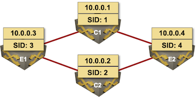

# Segment Routing (MPLS) Configuration Module

This configuration module configures SR-MPLS within the IS-IS routing process on Arista EOS, Cisco IOS XE (CSR), FRR, Junos, Nokia SR Linux, and Nokia SR OS.

```eval_rst
.. contents:: Table of Contents
   :depth: 1
   :local:
   :backlinks: none
```

## Supported Features

Supported Segment Routing features:

* IPv4 and IPv6 (see [](sr-mpls-platforms))
* IS-IS routing protocol
* IPv4 Node SID
* IPv6 Node SID

The module depends on the IS-IS module and will trigger a configuration error if the **isis** module is not enabled in the network topology.

(sr-mpls-platforms)=
## Supported Platforms

SR-MPLS is implemented on the following platforms:

| Operating system      | IPv4  | IPv6 | IS-IS | OSPF |
| ----------------------| :---: | :--: | :---: | :--: |
| Arista EOS            |   ✅  |  ✅  |  ✅   |  ❌   |
| Cisco IOS XE[^xe]     |   ✅  |  ❌   |  ✅   |  ❌   |
| FRRouting             |   ✅  |  ✅  |  ✅   |  ❌   |
| Juniper vMX           |   ✅  |  ✅  |  ✅   |  ❌   |
| Juniper vPTX          |   ✅  |  ✅  |  ✅   |  ❌   |
| Juniper vSRX          |   ✅  |  ✅  |  ✅   |  ❌   |
| Nokia SR Linux [❗](caveats-srlinux) |   ✅  |  ❌   |  ✅   |  ❌   |
| Nokia SR OS[^SROS]    |   ✅  |  ✅  |  ✅   |  ❌   |

[^xe]: Catalyst 8000v, Cisco CSR 1000v, Cisco IOS on Linux (IOL) and IOL layer-2 image.

[^SROS]: Includes the Nokia SR-SIM container and the Virtualized 7750 SR and 7950 XRS Simulator (vSIM) virtual machine

## Global Parameters

The SR-MPLS module configures Node SIDs for the IPv4 and IPv6 address families (AFs). The values of the AF Node SID are generated from node identifiers and AF-specific offsets. These offsets are controlled with two global parameters:

* **sr.node_sid_offset.ipv4** (default: 0) -- Node SID offset for IPv4 loopback prefix
* **sr.node_sid_offset.ipv6** (default: 100) -- Node SID offset for IPv6 loopback prefix

(sr-mpls-af)=
You can also control which address families participate in SR-MPLS with the global **sr.af** dictionary. If **sr.af** is not defined, SR-MPLS is enabled for all address families configured on the node.

* **sr.af.ipv4** (boolean) -- Enable or disable SR-MPLS for IPv4
* **sr.af.ipv6** (boolean) -- Enable or disable SR-MPLS for IPv6

## Device Parameters

Some devices (Nokia SR OS, Nokia SR Linux) have a configurable Segment Routing Global Block (SRGB). The SRGB can be configured with these device- or node attributes:

* **sr.srgb.start** -- the start of SRGB
* **sr.srgb.size** -- the size of SRGB

You can set these parameters as node attributes or change device [defaults](topo-defaults), for example:

```
defaults.devices.srsim.sr.srgb.start: 200000
```

## Node Parameters

You can configure Node SIDs (mapped to loopback IPv4/IPv6 prefixes) with these node parameters:

* **sr.node_sid.ipv4** (default: node identifier) -- IPv4 Node SID
* **sr.node_sid.ipv6** (default: node identifier + 100) -- IPv6 Node SID

You can limit the SR-MPLS address families for an individual node with the **sr.af** node dictionary ([details](sr-mpls-af)). Use this parameter in dual-stack labs with devices that do not support SR-MPLS for IPv6. Without an explicit **sr.af** definition, SR-MPLS is configured for all address families[^v46] used by the node.

[^v46]: IPv4 and/or IPv6

## Example

We want to create a four-router multi-vendor SR-MPLS network.



All devices run IS-IS and SR-MPLS:
```
module: [ sr, isis ]
```

We want to use unnumbered P2P interfaces and dual-stack deployment with IPv6 configured on loopback addresses:

```
addressing:
  p2p:
    unnumbered: true
  loopback:
    ipv6: 2001:db8:cafe::/48
```

Two of the devices in our topology run Cisco IOS XE, and the other two run Arista EOS:

```
nodes:
  e1:
    device: csr
  e2:
    device: eos
  c1:
    device: csr
  c2:
    device: eos
```

The devices are connected into a square topology, with two of them having stub links:

```
links:
- e1-c1
- e1-c2
- e2-c1
- e2-c2
- e1
- e2
```

### Resulting Device Configurations

The above topology generates the following device configurations (focusing just on segment routing and IS-IS parts).

#### E1 (Cisco IOS)

```
segment-routing mpls
 !
 set-attributes
  address-family ipv4
   explicit-null
  exit-address-family
 !
 !
 connected-prefix-sid-map
  address-family ipv4
   10.0.0.3/32 index 3 range 1
  exit-address-family
!
interface Loopback0
 ip address 10.0.0.3 255.255.255.255
 ip router isis Gandalf
 ipv6 address 2001:DB8:CAFE:3::1/64
 ipv6 router isis Gandalf
!
router isis Gandalf
 net 49.0001.0000.0000.0003.00
 is-type level-2-only
 metric-style wide
 log-adjacency-changes
 segment-routing mpls
 !
 address-family ipv6
  multi-topology
 exit-address-family
```

#### E2 (Arista EOS)

```
interface Loopback0
   ip address 10.0.0.4/32
   ipv6 address 2001:db8:cafe:4::1/64
   node-segment ipv4 index 4
   node-segment ipv6 index 104
   isis enable Gandalf
!
router isis Gandalf
   net 49.0001.0000.0000.0004.00
   is-hostname e2
   is-type level-2
   log-adjacency-changes
   !
   address-family ipv4 unicast
   !
   address-family ipv6 unicast
      multi-topology
   !
   segment-routing mpls
      no shutdown
```
