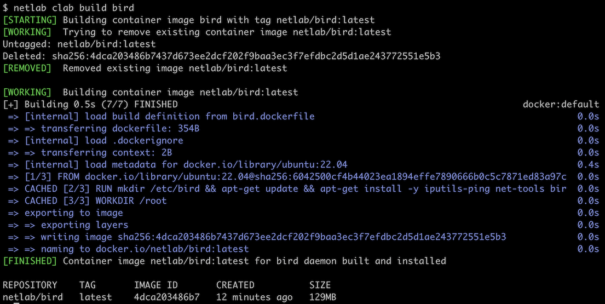

# Containerlab Utilities

**netlab clab** performs these *containerlab*-related functions:

* **tarball** -- [creates a tar archive](netlab-clab-tarball) that can recreate the lab in a vanilla *containerlab* environment without *netlab*.
* **build** -- [builds a Docker container](netlab-clab-build) for a routing daemon. You can use such containers (together with user-defined configuration files) as images for Linux devices running under _containerlab_.

(netlab-clab-tarball)=
## Building a Containerlab Distribution

The **netlab clab tarball** command:

* Collects device configurations from the current lab
* Creates a new copy of *containerlab* configuration file (*clab.config.yml*) that contains pointers to startup configurations
* Creates a tar archive containing *clab.config.yml* and related device configurations.

You can use this command only after starting a *containerlab*-only lab topology with devices that support the `startup-config` containerlab parameter.

You can use the tar archive created by **netlab clab tarball** to recreate the lab in a *containerlab* environment without installing *netlab*.

```
usage: netlab clab tarball [-h] [-v] [-q] [--config [OUTPUT]] [--cleanup] tarball

Create a ready-to-use tarball containing containerlab configuration file and startup
configs

positional arguments:
  tarball            Destination tarball (.tar.gz will be added if needed)

optional arguments:
  -h, --help         show this help message and exit
  -v, --verbose      Verbose logging
  -q, --quiet        Run Ansible playbook and tar with minimum output
  --config [OUTPUT]  Startup configuration directory (default: config)
  --cleanup          Clean up config directory and modified configuration file after
                     creating tarball
```

(netlab-clab-build)=
## Building a Docker Container

_netlab_ package includes *Dockerfiles* for several well-known routing daemons. You can use the **netlab clab build _image_** command to build a Docker container running the specified routing daemon.

```
$ netlab clab build -h
usage: netlab clab build [-h] [-l] [-t TAG] [image]

Build a Docker container image for a routing daemon

positional arguments:
  image              Routing daemon name

options:
  -h, --help         show this help message and exit
  -l, --list         List available routing daemons
  -t TAG, --tag TAG  Specify a non-default tag for the container image
```

For example, use `netlab clab build bird` to build the **netlab/bird:latest** container:



To list the available *Dockerfiles*, use the **netlab clab build --list** command:

```
$ netlab clab build --list

The 'netlab build' command can be used to build the following container images

┏━━━━━━━━┳━━━━━━━━━━━━━━━━━━━━┳━━━━━━━━━━━━━━━━━━━━━━━━━━━━━━━━━━━━━━━━━━━━━━━━┓
┃ daemon ┃ default tag        ┃ description                                    ┃
┡━━━━━━━━╇━━━━━━━━━━━━━━━━━━━━╇━━━━━━━━━━━━━━━━━━━━━━━━━━━━━━━━━━━━━━━━━━━━━━━━┩
│ bird   │ netlab/bird:latest │ BIRD Internet Routing Daemon (bird.network.cz) │
└────────┴────────────────────┴────────────────────────────────────────────────┘
```

