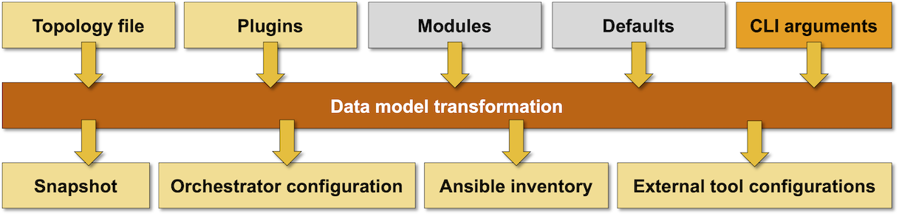

# Create Lab Configuration Files

The **netlab create** command reads network topology description in YAML format, performs data transformation from high-level data model to devices-and-links data model, and creates virtualization- and automation configuration files needed to set up your lab.



## Network Topology Sources

**netlab create** uses these sources of information to build the desired lab topology:

* Network topology in YAML format (default: `topology.yml`, but see also [](../dev/versioning.md))
* [Default settings](../defaults.md) that can be specified in [project-, user- or system default files](defaults-locations)

## Data Model Transformation

After reading the network topology, **netlab create** performs a complex data transformation to create device- and link-level data structures fully describing network topology, IP addressing and (optional) routing protocols.

You can influence the data model transformation with optional [configuration modules](../modules.md) and [custom plugins](../plugins.md).

## Creating Configuration Files

**netlab create** uses transformed node- and link-level data structures to create:

* Snapshot of the transformed topology in the **netlab.snapshot.yml** file. This file is used by **netlab down** command to find the virtualization provider and link (bridge) names.
* **Vagrantfile** supporting *[libvirt](../labs/libvirt.md)* or *[virtualbox](../labs/virtualbox.md)* environment
* **clab.yml** file used by *containerlab*.
* Ansible inventory[^1], either as a single-file data structure, or as a minimal inventory file with data stored primarily in **host_vars** and **group_vars**
* Various graphs in *graphviz* DOT format
* YAML or JSON representation of transformed lab topology or parts of the transformed data model
* Configuration file for *graphite* visualization tool

```{warning}
**‌netlab create** command refuses to create provider configuration files, Ansible inventory, or `netlab.snapshot.yml` file if it finds `netlab.lock` file in the current directory. 

`netlab.lock` file is created by the **‌netlab up** command to ensure subsequent **‌netlab create** commands don't overwrite the provider configuration files. It is automatically removed after a successful completion of **‌netlab down** command.
```

The _[](netlab-create-output-formats)_ section describes how you can control the output files and their format with CLI parameters. See _[](../outputs/index.md)_ for more details on individual file formats.

[^1]: Or *netlab-devices.yml* file when the `--devices` flag is used

## Usage

```text
usage: netlab create [-h] [--log] [-q] [-v] [--defaults DEFAULTS] [-d DEVICE]
                     [-p PROVIDER] [-s SETTINGS] [--plugin PLUGIN]
                     [-o OUTPUT] [topology]

Create provider- and automation configuration files

positional arguments:
  topology              Topology file (default: topology.yml)

optional arguments:
  -h, --help            show this help message and exit
  --log                 Enable basic logging
  -q, --quiet           Report only major errors
  -v, --verbose         Verbose logging
  --defaults DEFAULTS   Local topology defaults file
  -d DEVICE, --device DEVICE
                        Default device type
  -p PROVIDER, --provider PROVIDER
                        Override virtualization provider
  --plugin PLUGIN       Additional plugin(s)
  -s SETTINGS, --set SETTINGS
                        Additional parameters added to topology file
  -o OUTPUT, --output OUTPUT
                        Output format(s): format:option=filename
  --devices             Create provider configuration file and netlab-devices.yml

output files created when no output is specified:

  * Transformed topology snapshot in netlab.snapshot.yml
  * Virtualization provider file with provider-specific filename
    (Vagrantfile or clab.yml)
  * Ansible inventory file (hosts.yml) and configuration (ansible.cfg)

For a complete list of output formats please consult the documentation
```

For more details on topology file format, please read the [lab topology overview](../topology-overview.md) and [reference documentation](../topology-reference.md).

(netlab-create-output-formats)=
## Output Formats

Without specifying the output format(s), **netlab create** creates a provider configuration file (*Vagrantfile* or *clab.yml*) and either [Ansible inventory data](../outputs/ansible.md) (*hosts.yml*, *ansible.cfg*, *host_vars*, *group_vars*) or [*netlab-devices.yml* file](../outputs/devices.md) (if the `--devices` flag was specified).

You could specify one or more output formats with the `-o` CLI parameter. For more details please read the [output formats](../outputs/index.md) part of the documentation.

## Setting Topology Parameters from Command Line

The following CLI flags can be used to change individual topology parameters:

* `-d` sets default device type (**defaults.device**)
* `-p` sets virtualization provider (**provider**)
* `-s` uses `key=value` format to set specified topology element  value. The key could be a hierarchical dotted name.
* `--plugin` specifies additional plugins not listed in lab topology or system defaults (example: multilab plugin)

### Example

Assume the following topology file that uses *containerlab* provider to set up a lab of three Cumulus VX devices:

```
defaults:
  device: cumulus

provider: clab

module: [ ospf ]
nodes: [ s1, s2, s3 ]
links: [ s1-s2, s2-s3 ]
```

When running...

```
$ netlab create -d iosv -p libvirt -s ospf.area=123
```

... you'll get a Vagrant file using *vagrant-libvirt* plugin that will create a lab with three Cisco IOS routers. OSPF configuration of those routers will use area 123.

### Setting Node Parameters

The `--set` CLI parameter can set a scalar value (number, string, True/False) anywhere within the topology file dictionary hierarchy but cannot set parameters within lists. If you want to set parameters for individual nodes you have to use the [dictionary format](../nodes.md#dictionary-of-nodes) of the **nodes** top-level element.

Example: Assume you want to test OSPF interoperability between Cumulus Linux and other device types. Create a topology file as above, but specify nodes as a dictionary:

```
defaults:
  device: cumulus

module: [ ospf ]

nodes:
  s1:
  s2:
  s3:
links: [ s1-s2, s2-s3 ]
```

Now you can use the `--set nodes.sx.device` CLI parameter to change the device type of any node in the lab. To change S1 to Cisco IOS, use:

```
$ netlab up -s nodes.s1.device=iosv
```
