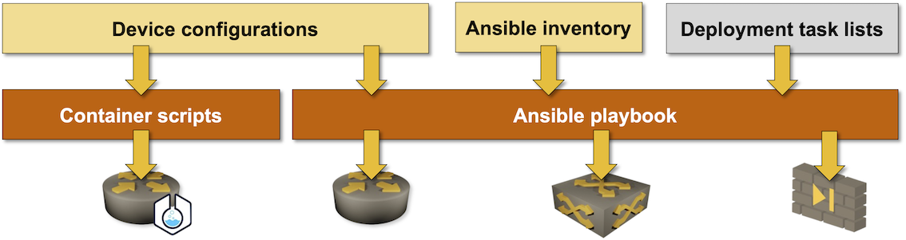

# Deploying Initial Device Configurations

**netlab initial** command uses expanded Ansible inventory data created with **[netlab create](create.md)** command, device-specific Jinja2 templates, and an internal Ansible playbook to deploy initial device configurations.



The Ansible playbook invoked by **netlab initial** command deploys device configurations in three steps:

* Initial device configurations[^itag]
* Module-specific device configurations[^mtag]
* Custom configuration templates[^ctag]

[^itag]: Controlled by `-i` flag or **initial** Ansible tag
[^mtag]: Controlled by `-m` flag or **module** Ansible tag
[^ctag]: Controlled by `-c` flag or **custom** Ansible tag

Jinja2 templates are used together with **_device_\_config** Ansible modules to configure most devices. In some cases, the configuration task list includes additional tasks[^init]. Some devices (for example, Fortinet firewall) are configured through calls to device-specific Ansible modules. See _[](../caveats.md)_ for more details.

[^init]: Cisco Nexus OS configuration cannot proceed until the Ethernet interfaces are ready -- that can take up to a minute after the VM boot completes. Arista cEOS cannot be configured until its SSH daemon starts.

When run with **-v** parameter, the command displays device configurations before deploying them.

```{tip}
**netlab initial** command does not need a topology file; It's just a thin wrapper around an Ansible playbook which uses Ansible inventory created by **netlab create** or **netlab up** command. You don't have to specify the topology file name or other **netlab create** CLI parameters you used to tweak the lab topology.
```

## Usage

```text
usage: netlab initial [--log] [-q] [-v] [-i] [-m [MODULE]] [-c] [--fast] [-o [OUTPUT]]

Initial device configurations

optional arguments:
  -h, --help            show this help message and exit
  --log                 Enable basic logging
  -q, --quiet           Report only major errors
  -v, --verbose         Verbose logging
  -i, --initial         Deploy just the initial configuration
  -m [MODULE], --module [MODULE]
                        Deploy module-specific configuration (optionally including a 
                        list of modules separated by commas)
  -c, --custom          Deploy custom configuration templates (specified in "config" 
                        group or node attribute)
  --fast                Use "free" strategy in Ansible playbook for faster
                        configuration deployment
  -o [OUTPUT], --output [OUTPUT]
                        Create a directory with initial configurations instead of
                        deploying them

All other arguments are passed directly to ansible-playbook
```

## Initial Device Configurations

Initial device configurations are created from inventory data and templates in `netsim/ansible/templates/initial` directory. Device-specific configuration template is selected using `network_device_type` or `ansible_network_os` value (making IOSv and CSR 1000v templates identical). See [](../dev/config/deploy.md) for more details.

The following initial configuration parameters are supported:

* hostname
* interface IPv4 and IPv6 addresses
* unnumbered interfaces
* interface descriptions
* interface MAC addresses
* interface bandwidth (when supported by the device)

The initial configuration also includes LLDP running on all interfaces apart from the management interface (not configurable).

Default passwords and other default configuration parameters are supposed to be provided by the Vagrant boxes.

## Module Configurations

Module-specific device configurations are created from templates in `netsim/ansible/templates/_module_` directory. Device-specific configuration template is selected using `netlab_device_type` or `ansible_network_os` value. 

More details: 

* [Module descriptions](../module-reference.md) contain list of supported model parameters.
* [](../dev/config/deploy.md) describes the details of template search process
* [](../dev/device-features.md) contains the configuration template guidelines.

(netlab-initial-custom)=
## Custom Deployment Templates

[Custom deployment templates](../groups.md#custom-configuration-templates) are specified in **config** group- or node parameter. `initial-config.ansible` playbook tries to find the target configuration template in user- (current) and system (`netsim/extra`) directories and uses `netlab_device_type` and `ansible_network_os` to allow you to create numerous device-specific configuration templates.

You'll find more details in _[](../dev/config/deploy.md)_ contributor documentation.

**netlab initial** command assumes you want to deploy the custom templates in the order you specified them and therefore deploys them on a single device at a time unless you use the `--fast` parameter.

```{warning}
Numerous Ansible versions "optimize" task execution by rearranging the order of loop parameters, potentially resulting in custom configurations being applied out of order. As a workaround, the Ansible play deploying custom configuration templates executes on a single device at a time. 

You can bypass that safety measure with `--fast` parameter, but don't complain if you get unexpected results.
```

## Limiting the Scope of Configuration Deployments

Without specifying `-i` or `-m` flag, the command deploys all initial configurations. To control the deployment of initial configurations:

* use the `-i` flag to deploy initial device configurations. 
* use the `-m` flag to deploy module-specific configurations. 
* use the `-m` flag followed by a module name (example: `-m ospf -m bgp`) to deploy device configuration for specific modules. You can use the `-m` flag multiple times.
* use the `-c` flag to deploy custom configuration templates. 

All unrecognized parameters are passed to internal `initial-config.ansible` Ansible playbook. You can use **ansible-playbook** CLI parameters to modify the configuration deployment, for example:

* `-l` parameter to deploy device configurations on a subset of devices.
* `-C` parameter to run the Ansible playbook in dry-run mode. Combine it with `-v` parameter to see the configuration changes that would be deployed[^vx]

[^vx]: The Ansible playbook uses **vtysh** on Cumulus VX to deploy the FRR-related configuration changes from a file. The dry run will not display the configuration changes.

## Debugging Initial Configurations

* Use `-o` flag to create device configurations without deploying them. The optional value of `-o` parameter specifies the output directory name (default: `config`)
* To display device configurations from within the Ansible playbook without deploying them, use `-v --tags test` flags (a bogus playbook tag disables configuration deployment).
