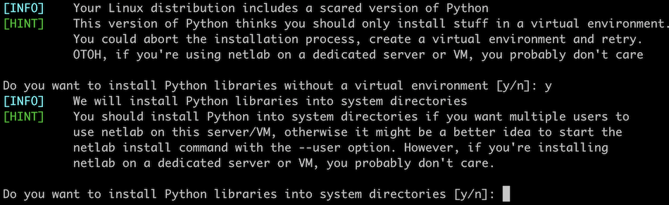

(netlab-install)=
# Install System Software

**netlab install** uses internal installation scripts to install nice-to-have Ubuntu software, Ansible and related networking libraries, or libvirt+vagrant.

The *ubuntu* and *libvirt* installation scripts run only on Ubuntu[^U20] and Debian[^D10]; the *ansible* installation script should run in any environment with **bash** and **pip3**.

## Usage

```text
usage: netlab install [-h] [-v] [-q] [-y] [-u][{ubuntu,containerlab,ansible,grpc,libvirt} ...]

Install additional software

positional arguments:
  {ubuntu,containerlab,ansible,grpc,libvirt}
                        Run the specified installation script

optional arguments:
  -h, --help            show this help message and exit
  -v, --verbose         Verbose logging
  -q, --quiet           Be as quiet as possible
  -y, --yes             Run the script without prompting for a confirmation
  -u, --user            Install Python libraries into user .local directory
```

## Installation Scripts

* The *ubuntu* script installs Python3 development components that might be needed for Ansible installation, common tools like **git** and **sshpass**, and XML libraries.
* The *ansible* script uses **pip3** to install the latest version of Ansible, networking libraries (*netaddr, paramiko, netmiko*), text parsing libraries (*testfsm, ttp, ntc-templates*), and a few other utility libraries (*jmespath, yamllint, yq*)
* The *libvirt* script installs *libvirt* and supporting libraries/packages, *vagrant*, *vagrant-libvirt* plugin, and creates the *vagrant-libvirt* virtual network.
* The *containerlab* script installs Docker Engine and *containerlab*.
* The *grpc* installs gRPC Python libraries needed to configure Nokia SR Linux and Nokia SR OS.

[^U20]: Tested on Ubuntu 20.04

[^D10]: Tested on Debian 10 and 11

(netlab-install-python)=
## Python Package Installation

Unless you started the **netlab install** command in a Python virtual environment, it runs **pip3** as root. You can change that default with the `-u` option, asking **netlab install** to install Python packages into the `~/.local` directory.

Newer Python installations (including Ubuntu 22.04) refuse to install Python packages outside a virtual environment. In these cases, **netlab install** asks the user for a confirmation and uses `--break-system-packages` **pip3** option to force user-wide or system-wide package installation:


