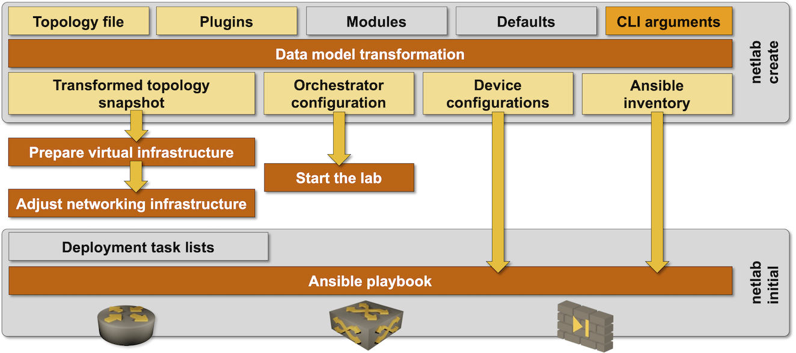

# Start Virtual Lab

**netlab up** is a high-level command that:

* Uses **[netlab create](create.md)** to create virtualization provider configuration file, transformed topology snapshot, and network automation configuration files (Ansible inventory). You can skip this step with the `--snapshot` flag;
* Checks the [virtualization provider](../providers.md) installation;
* Create the required virtual infrastructure (see below)
* Starts the virtual lab using the [selected virtualization provider](topology-reference-top-elements);
* Performs provider-specific initialization (see below)
* Deploys device configurations with **[netlab initial](initial.md)** command unless it was started with the `--no-config` flag

After the lab has been configured with **netlab initial**, **netlab up** displays the [help **message** defined in the lab topology](topology-reference-top-elements).

You can use `netlab up` to create configuration files and start the lab, or use `netlab up --snapshot` to start a previously created lab using the transformed lab topology stored in `netlab.snapshot.yml` snapshot file.



## Usage

```text
usage: netlab up [-h] [--log] [-q] [-v] [--debug] [--defaults DEFAULTS] [-d DEVICE]
                 [-p PROVIDER] [--plugin PLUGIN][-s SETTINGS] 
                 [--no-config] [--fast-config] [topology]

Create configuration files, start a virtual lab, and configure it

positional arguments:
  topology              Topology file (default: topology.yml)

optional arguments:
  -h, --help            show this help message and exit
  --log                 Enable basic logging
  -q, --quiet           Report only major errors
  -v, --verbose         Verbose logging
  --debug               Debugging (might not execute external commands)
  --defaults DEFAULTS   Local topology defaults file
  -d DEVICE, --device DEVICE
                        Default device type
  -p PROVIDER, --provider PROVIDER
                        Override virtualization provider
  --plugin PLUGIN       Additional plugin(s)
  -s SETTINGS, --set SETTINGS
                        Additional parameters added to topology file
  --no-config           Do not configure lab devices
  --fast-config         Use fast device configuration (Ansible strategy = free)
  --snapshot [SNAPSHOT]
                        Use netlab snapshot file created by a previous lab run
```

```{warning}
Do not use the `--fast-config` option with custom configuration templates that must be executed in specific order. See **‌[netlab initial](netlab-initial-custom)** documentation for more details.
```

## Conflict Resolution

**netlab up** command checks the netlab status file (default: `~/.netlab/status.yml`) to verify that the current lab instance (default: `default`) is not running in another directory. You cannot start two copies of the same lab instance (even if they're using different directories) due to potential management MAC/IP address overlap. If you want to run multiple lab instances on the same server, use the **‌[multilab](../plugins/multilab.md)** plugin.

**netlab up** command also uses the `netlab.lock` file in the current directory before invoking **netlab create** process to ensure you cannot accidentally overwrite provider configuration files. If you want to resume a failed lab startup process (usually caused by VM timeouts), use **netlab up --snapshot** command which skips the **netlab create** process.

## Provider-Specific Initialization

**netlab up** can execute provider-specific tasks before invoking the orchestration tool (*Vagrant* or *containerlab*) or after the virtual lab has been created

### Tasks executed before the lab is started

* When used with *clab* provider, **netlab up** creates Open vSwitch bridges or standard Linux bridges needed to implement multi-access networks.
* When used with *libvirt* provider, **netlab up** creates the *vagrant-libvirt* management network

### Tasks executed after the lab creation is completed

* When used with *libvirt* provider, **netlab up** sets the `group_fwd_mask` for all Vagrant-created Linux bridges to [enable LLDP passthrough](https://blog.ipspace.net/2020/12/linux-bridge-lldp.html).
