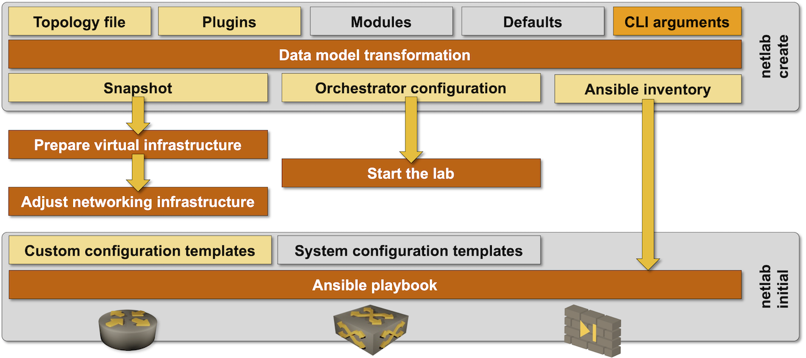

(netlab-up)=
# Start a Virtual Lab

**netlab up** is a high-level command that:

* Uses **[netlab create](create.md)** to create virtualization provider configuration file, transformed topology snapshot, and network automation configuration files (Ansible inventory).

```{tip}
You can skip this step and reuse existing configuration files with the `--snapshot` flag ([more details](netlab-up-restart));
```

* Checks the [virtualization provider](../providers.md) installation;
* Creates the lab management network ([more details](libvirt-mgmt))
* Starts the virtual lab using the [selected virtualization provider](topology-reference-top-elements);
* Performs provider-specific initialization ([more details](netlab-up-provider))
* Deploys device configurations with **[netlab initial](initial.md)** command unless it was started with the `--no-config` flag, or reloads saved configurations if it was started with the `--reload-config` flag.



After configuring the lab with **netlab initial**, **netlab up** displays the [help **message** defined in the lab topology](topology-reference-top-elements).

```eval_rst
.. contents:: Table of Contents
   :depth: 2
   :local:
   :backlinks: none
```


## Usage

You can use `netlab up` to create configuration files and start the lab, or use `netlab up --snapshot` to start a previously created lab or restart a lab after a server reboot ([more details](netlab-up-restart)) using the transformed lab topology stored in `netlab.snapshot.yml` snapshot file.

```text
usage: netlab up [-h] [--log] [-v] [-q] [--defaults [DEFAULTS ...]] [-d DEVICE]
                 [-p PROVIDER] [--plugin PLUGIN] [-s SETTINGS] [--no-config] [-r RELOAD]
                 [--no-tools] [--dry-run] [--fast-config] [--snapshot [SNAPSHOT]]
                 [topology]

Create configuration files, start a virtual lab, and configure it

positional arguments:
  topology              Topology file (default: topology.yml)

options:
  -h, --help            show this help message and exit
  --log                 Enable basic logging
  -v, --verbose         Verbose logging (add multiple flags for increased verbosity)
  -q, --quiet           Report only major errors
  --defaults [DEFAULTS ...]
                        Local topology defaults file
  -d DEVICE, --device DEVICE
                        Default device type
  -p PROVIDER, --provider PROVIDER
                        Override virtualization provider
  --plugin PLUGIN       Additional plugin(s)
  -s SETTINGS, --set SETTINGS
                        Additional parameters added to topology file
  --no-config           Do not configure lab devices
  -r RELOAD, --reload-config RELOAD
                        Reload saved configurations from specified directory
  --no-tools            Do not start the external tools
  --dry-run             Print the commands that would be executed, but do not execute
                        them
  --fast-config         Use fast device configuration (Ansible strategy = free)
  --snapshot [SNAPSHOT]
                        Use netlab snapshot file created by a previous lab run
```

```{warning}
Do not use the `--fast-config` option with custom configuration templates that must be executed in a specific order. See **‌[netlab initial](netlab-initial-custom)** documentation for more details.
```

## Conflict Resolution

**netlab up** command checks the netlab status file (default: `~/.netlab/status.yml`) to verify that the current lab instance (default: `default`) is not running in another directory. You cannot start two copies of the same lab instance (even if they use different directories) due to potential management MAC/IP address overlap. If you want to run multiple lab instances on the same server, use the **‌[multilab](../plugins/multilab.md)** plugin.

**netlab up** command also uses the `netlab.lock` file in the current directory before invoking the **netlab create** process to ensure you cannot accidentally overwrite provider configuration files. If you want to resume a failed lab startup process (usually caused by VM timeouts), use the **netlab up --snapshot** command, which skips the **netlab create** process.

```{tip}
**netlab up --dry-run** command recreates the configuration files and cannot be used in a directory with a running lab. Use **netlab up --snapshot --dry-run** to display the commands used to start the lab.
```

(netlab-up-reload)=
## Reloading Saved Configurations

When started with the `--reload-config` flag, **netlab up** tries to load device configurations saved with a previous **netlab collect** command to the newly-started lab devices.

The process should work (relatively) flawlessly on traditional network devices that use a single configuration file. However, do keep in mind these caveats:

* Saved device configurations don't replace startup device configurations; they are merged with them.
* IP addresses (including management IP addresses) are hardcoded in the saved device configurations. Any change to the topology file, user defaults, system defaults, or **netlab up** CLI parameters can change device configurations. Restoring saved configurations after such a change will probably break the lab.

There are also numerous device-specific caveats:

* Only the FRRouting configuration is restored on Cumulus Linux and FRR. **netlab** executes initial device configuration on these devices to set up interfaces and enable FRRouting daemons.
* The initial state of Cisco IOS interfaces is **shutdown**, but the saved configuration does not include the **no shutdown** command. **netlab** executes the initial configuration on Cisco IOS/IOS-XE devices to enable the interfaces.

(netlab-up-restart)=
## Restarting a Lab after a Server Reboot

You can use the `netlab up --snapshot` command to restart a lab after a server crash, power failure, or reboot. 

The command will power up the existing Vagrant virtual machines, recreate networking components, and restart the containers (including the [VM-in-container *vrnetlab* containers](clab-vrnetlab)).

The restarted virtual machines will start with the saved startup configuration (assuming you saved the configuration before the crash), allowing you to skip the initial configuration process with the `netlab up --snapshot --no-config` command.

_netlab_ cannot recreate the container configurations. While starting the lab, you can reload the configuration with the `netlab up --snapshot --reload` command if you previously collected it with the **[netlab collect](netlab-collect)** command.

(netlab-up-provider)=
## Provider-Specific Initialization

**netlab up** can execute provider-specific tasks before invoking the orchestration tool (*Vagrant* or *containerlab*) or after the virtual lab has been created

### Tasks executed before the lab is started

* When used with *clab* provider, **netlab up** creates Open vSwitch bridges or standard Linux bridges needed to implement multi-access networks.
* When used with *libvirt* provider, **netlab up** creates the *vagrant-libvirt* management network

### Tasks executed after the lab creation is completed

* When used with *libvirt* provider, **netlab up** sets the `group_fwd_mask` for all Vagrant-created Linux bridges to [enable LLDP passthrough](https://blog.ipspace.net/2020/12/linux-bridge-lldp.html).
