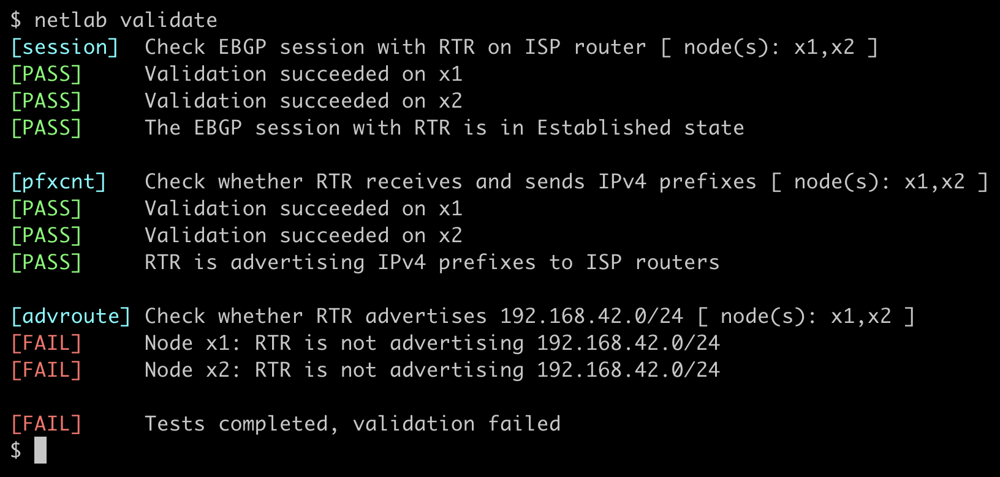

(netlab-validate)=
# Validate Lab Network

**netlab validate** executes tests defined in the **[validate](../topology/validate.md)** lab topology attribute on a running lab. It can be used in training labs to check whether the user has successfully completed the lab assignment.

## Usage

```text
$ netlab validate -h
usage: netlab inspect [-h] [-v] [--snapshot [SNAPSHOT]] [--list] [--node NODES] [tests ...]

Inspect data structures in transformed lab topology

positional arguments:
  tests                 Validation test(s) to execute (default: all)

options:
  -h, --help            show this help message and exit
  -v, --verbose         Verbose logging (add multiple flags for increased verbosity)
  --snapshot [SNAPSHOT]
                        Transformed topology snapshot file
  --list                List validation tests
  --node NODES          Execute validation tests only on selected node(s)
  --skip-wait           Skip the waiting period
  -e, --error-only      Display only validation errors (on stderr)
```

The **netlab validate** command returns the overall test results in its exit code:

| Exit code | Meaning |
|----------:|---------|
| 0 | All tests passed |
| 1 | At least one test failed |
| 2 | `netlab validate` did not find a single usable test to execute |
| 3 | Some of the tests generated warnings |

## Example

**netlab validate** command was executed on the [Advertise IPv4 Prefixes to BGP Neighbors](https://bgplabs.net/basic/3-originate/) lab before the user configured BGP prefix origination:



```{tip}
* Use **‌netlab validate --error-only** to shorten the printout and display only the validation errors.
```
