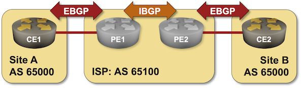

# BGP Domains Plugin

The **bgp.domain** plugin allows you to create multiple independent copies of the same autonomous system, for example, when testing MPLS/VPN topologies in which all customer sites use the same AS number.



Using the default _netlab_ [IBGP session establishment rules](bgp-ibgp-sessions), you'd get an IBGP session between the loopback interfaces of CE1 and CE2, resulting in "interesting" BGP tables and (potentially) recursive routing.

With the **bgp.domain** plugin, you can specify a BGP domain for each router, effectively splitting routers using the same BGP AS number into smaller sets. This is how you would describe the above topology using the **bgp.domain** plugin:

```
module: [ bgp, ospf ]
plugin: [ bgp.domain ]
defaults.device: cumulus

nodes:
  ce1:
    bgp.as: 65000
    bgp.domain: site_a
  ce2:
    bgp.as: 65000
    bgp.domain: site_b
  pe1:
    id: 10
    bgp.as: 65100
  pe2:
    id: 11
    bgp.as: 65100

links: [ ce1-pe1, pe1-pe2, pe2-ce2 ]
```

## Supported Platforms

The plugin modifies the list of IBGP sessions generated by the [](../module/bgp.md) and works with any platform supported by that module.

## New Attributes

The plugin defines a new node attribute: 

* **bgp.domain** (string) -- the domain of a BGP router (default: `default`)
