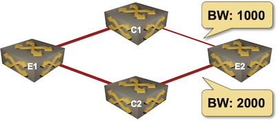

# Lab Topology Overview

Topology description file is a YAML file with these top-level elements:

**defaults** (optional)
: Topology-wide defaults like default device type. Further default settings are taken from [user- or system-wide defaults](defaults.md).

**addressing** (optional)
: [IPv4 and IPv6 pools](addressing.md) used to address management, loopback, LAN, P2P and stub interfaces

**nodes**
: Lab devices (nodes). Individual nodes could be specified by node *name* (string) or a dictionary of node attributes including **name**. Use a node dictionary when you want to specify non-default device type or additional node attributes. See [Topology Reference -- Nodes](nodes.md) for more details.

**groups**
: [Groups of lab devices (nodes)](groups.md). Used to create inventory groups, either to add group variables, or for simpler deployment of group-wide custom configurations.

**links**
: [List of links](links.md) between lab devices. Formatted as a list of strings or dictionaries.

**module** (optional)
: List of [optional configuration modules](modules.md) used by this network topology

**name** (optional)
: Topology name -- used to name Linux bridges when using *libvirt* Vagrant plugin

**provider** (optional)
: Virtualization provider (*libvirt*, *virtualbox*, *clab* or *external*). Default value: *libvirt*.

**tools** (optional)
: [External network management tools](extools.md) deployed together with the lab topology

Sounds confusing? The following sample topology file should help you grasp the concepts. You might also want to [explore the tutorials](tutorials.md).

Want to know more? Please explore the [lab topology reference](topology-reference.md) documentation.

## Sample Topology File

We'll build a simple network topology file describing a 4-node network:



We'll start with the list of nodes. All devices will run Arista EOS, so we'll specify the device type as topology default.

```
---
defaults.device: eos

nodes:
- e1
- c1
- c2
- e2
```

Next, we'll add the links, using string values to specify point-to-point links.

```
links:
- e1-c1
- e1-c2
- c1-e2
- c2-e2
```

However, two of the links require additional attributes (*bandwidth*), so we'll change `c1-e2` and `c2-e2` links from string format into dictionary format

```
links:
- e1-c1
- e1-c2
- c1:
  e2:
  bandwidth: 1000
- c2:
  e2:
  bandwidth: 1000
```

Here is the complete topology file that you could use to build the virtual network[^1]:

```
---
defaults.device: eos

nodes: [ e1, c1, c2, e2 ]

links:
- e1-c1
- e1-c2
- c1:
  e2:
  bandwidth: 1000
- c2:
  e2:
  bandwidth: 1000
```

[^1]: The **nodes** list has been transformed to an inline list to make the example at least marginally interesting.

Finally, we'll run OSPF between the four devices. Optional configuration module are specified with the **module** parameter; adding OSPF is as easy as adding a single **module: [ ospf ]** line to the topology file:

```
---
defaults.device: eos
module: [ ospf ]

nodes: [ e1, c1, c2, e2 ]

links:
- e1-c1
- e1-c2
- c1:
  e2:
  bandwidth: 1000
- c2:
  e2:
  bandwidth: 1000
```