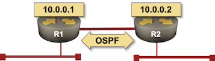

# Tutorials

In this tutorial we'll build a simple 2-node network running OSPF. We're assuming you already [installed *netsim-tools*](install.md) and all the software needed to run your labs on *[libvirt](labs/libvirt.md)* or *[Virtualbox](labs/virtualbox.md)*.

For a step-by-step tutorial covering all the steps, please read *[A Quick Introduction to Netsim-Tools](https://blog.kirchne.red/netsim-tools-quickstart.html)* by [Leo Kirchner](https://www.linkedin.com/in/leo-kirchner/).

For more complex tutorials, check the *[More Tutorials](#more-tutorials)* section at the end of this document.



## Preparing the Network Device Images

We'll use Arista EOS box available for download on [Arista's web site](https://www.arista.com/en/support/software-download) (login required). Alternatively, you could use Cumulus VX, but it's a bit harder to work with unless you're used to working with Linux-based network devices using FRR.

* Download the Arista vEOS Box file. The most recent vEOS version accessible in that format seems to be `vEOS-lab-4.21.14M-virtualbox.box`.
* Install the .box file with `vagrant box add vEOS-lab-4.21.14M-virtualbox.box --name arista/veos`
* If you're using *libvirt*, mutate the *virtualbox* box you've just installed with `vagrant mutate arista/veos libvirt`.

## Creating Lab Topology File

In an empty directory create the [lab topology file](topology-overview.md) `topology.yml`:

```
---
provider: virtualbox
defaults:
  device: eos
module: [ ospf ]

nodes: [ r1, r2 ]
links:
- r1
- r2
- r1-r2
```

The networking lab specified in the above topology file:

* Uses *virtualbox* Vagrant provider
* Uses Arista vEOS as the default device
* Uses OSPF as the routing protocol
* Has two nodes (*r1* and *r2*)
* Has three links -- a stub network connected to *r1*, another stub network connected to *r2*, and a link between *r1* and *r2*.

**Notes:**
* If you're using *libvirt*, remove the **provider** line.
* If you prefer using Cumulus VX, replace `device: eos` with `device: cumulus`

## Starting the Lab

Create **Vagrantfile**, **hosts.yml** (Ansible inventory file) and **ansible.cfg** (Ansible configuration file) with **[netlab initial](../netlab/initial.md)** tool:

```
$ netlab create
Created provider configuration file: Vagrantfile
Created group_vars for eos
Created host_vars for r1
Created host_vars for r2
Created minimized Ansible inventory hosts.yml
Created Ansible configuration file: ansible.cfg
```

Start the lab with `vagrant up`. Once all the lab devices have started, connect to individual devices with `vagrant ssh`.

```
$ vagrant up
Bringing machine 'r1' up with 'virtualbox' provider...
Bringing machine 'r2' up with 'virtualbox' provider...
==> r1: Importing base box 'arista/veos'...
==> r1: Matching MAC address for NAT networking...
==> r1: Setting the name of the VM: x_r1_1621787250237_83508
==> r1: Clearing any previously set network interfaces...
==> r1: Preparing network interfaces based on configuration...
    r1: Adapter 1: nat
    r1: Adapter 2: intnet
    r1: Adapter 3: intnet
==> r1: Forwarding ports...
    r1: 22 (guest) => 2001 (host) (adapter 1)
    r1: 80 (guest) => 8001 (host) (adapter 1)
    r1: 830 (guest) => 3001 (host) (adapter 1)
==> r1: Running 'pre-boot' VM customizations...
==> r1: Booting VM...
==> r1: Waiting for machine to boot. This may take a few minutes...
    r1: SSH address: 127.0.0.1:2001
    r1: SSH username: root
    r1: SSH auth method: private key
    
... rest deleted...
```

## Deploying Device Configurations

You'll need a working Ansible installation for the rest of this tutorial. Please follow the instructions in [Installing Ansible](https://docs.ansible.com/ansible/latest/installation_guide/intro_installation.html#installing-ansible-on-specific-operating-systems) documentation[^1].

[^1]: I prefer using **homebrew** to install Ansible on MacOS.

The Ansible inventory created by **netlab create** command contains enough information to configure interfaces and OSPF routing process. Here's the inventory information for *r1* (`host_vars/r1/topology.yml`):

```
# Ansible inventory created from ['lab.yml', 'package:topology-defaults.yml']
#
---
box: arista/veos
links:
- bridge: x_1
  ifindex: 1
  ifname: Ethernet1
  ipv4: 172.16.0.1/24
  linkindex: 1
  neighbors: {}
  type: stub
- ifindex: 2
  ifname: Ethernet2
  ipv4: 10.1.0.1/30
  linkindex: 3
  name: r1 -> r2
  neighbors:
    r2:
      ifname: Ethernet2
      ipv4: 10.1.0.2/30
  remote_id: 2
  remote_ifindex: 2
  type: p2p
loopback:
  ipv4: 10.0.0.1/32
mgmt:
  ifname: Management1
  ipv4: 192.168.121.101
  mac: 08-4F-A9-00-00-01
module:
- ospf
```

To configure the lab devices, run **[netlab initial](../netlab/initial.md)** command. We'll use the `dense` Ansible callback to minimize the amount of detritus generated by internal Ansible playbook used by **netlab initial**:

```
$ ANSIBLE_STDOUT_CALLBACK=dense netlab initial
PLAY 1: DEPLOY DEVICE CONFIGURATION
task 3: r1 r2
task 7: r1 r2
```

If you want to inspect the deployed device configurations, you could use the `-v` (verbose) flag -- the playbook would print out the device configurations before they'd be deployed -- or `-o` flag to create configuration snippets in `config` directory.

## Connecting to Network Devices

After installing Ansible, you could use the **[netlab connect](../netlab/connect.md)** command to connect to network devices[^2] and inspect the OSPF neighbors and IP routing table:

[^2]: **netlab connect** uses Ansible inventory to find the administrator username and password, device IP address and SSH port name.

```
$ netlab connect r1
Connecting to host vagrant@127.0.0.1 via SSH using port 2001...
Last login: Sun May 23 16:42:00 2021 from 10.0.2.2
r1#show ip ospf neighbor
Neighbor ID     VRF      Pri State                  Dead Time   Address         Interface
10.0.0.2        default  0   FULL                   00:00:30    10.1.0.2        Ethernet2
r1#show ip route

VRF: default
Codes: C - connected, S - static, K - kernel,
       O - OSPF, IA - OSPF inter area, E1 - OSPF external type 1,
       E2 - OSPF external type 2, N1 - OSPF NSSA external type 1,
       N2 - OSPF NSSA external type2, B I - iBGP, B E - eBGP,
       R - RIP, I L1 - IS-IS level 1, I L2 - IS-IS level 2,
       O3 - OSPFv3, A B - BGP Aggregate, A O - OSPF Summary,
       NG - Nexthop Group Static Route, V - VXLAN Control Service,
       DH - DHCP client installed default route, M - Martian,
       DP - Dynamic Policy Route, L - VRF Leaked

Gateway of last resort is not set

 C        10.0.0.1/32 is directly connected, Loopback0
 O        10.0.0.2/32 [110/20] via 10.1.0.2, Ethernet2
 C        10.0.2.0/24 is directly connected, Management1
 C        10.1.0.0/30 is directly connected, Ethernet2
 C        172.16.0.0/24 is directly connected, Ethernet1
 O        172.16.1.0/24 [110/20] via 10.1.0.2, Ethernet2

r1#
```

## Cleanup

Destroy the lab with `vagrant destroy -f`:

```
$ vagrant destroy -f
==> r2: Forcing shutdown of VM...
==> r2: Destroying VM and associated drives...
==> r1: Forcing shutdown of VM...
==> r1: Destroying VM and associated drives...
```

## More Tutorials

* [Use Katacoda to test netsim-tools with Containerlab and FRRouting](https://blog.ipspace.net/2021/04/katacoda-netsim-containerlab-frr.html)
* [Building Unnumbered Ethernet Lab with netsim-tools](https://blog.ipspace.net/2021/04/build-unnumbered-lab-netsim-tools.html)

### Configuration Module Examples

Documentation of individual configuration modules includes sample lab topology files:

* [OSPF example](module/ospf.md#example)
* [IS-IS example](module/isis.md#example)
* [Multiple BGP examples](module/bgp.md#more-examples)
* [Segment Routing example](module/sr-mpls.md#example)
